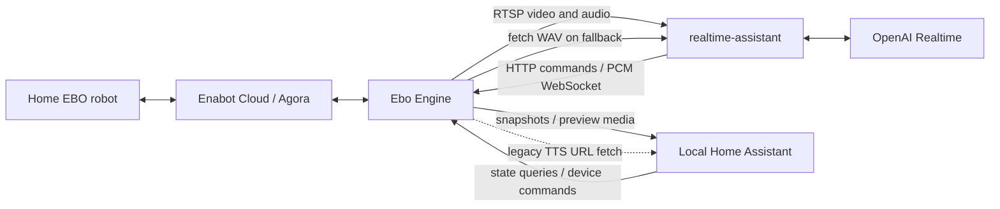
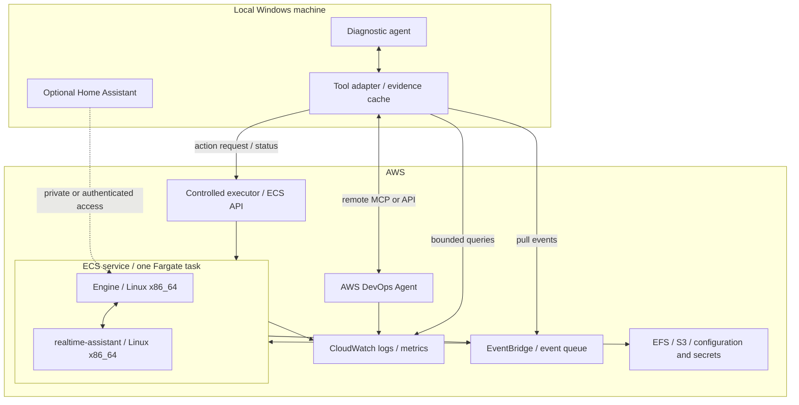
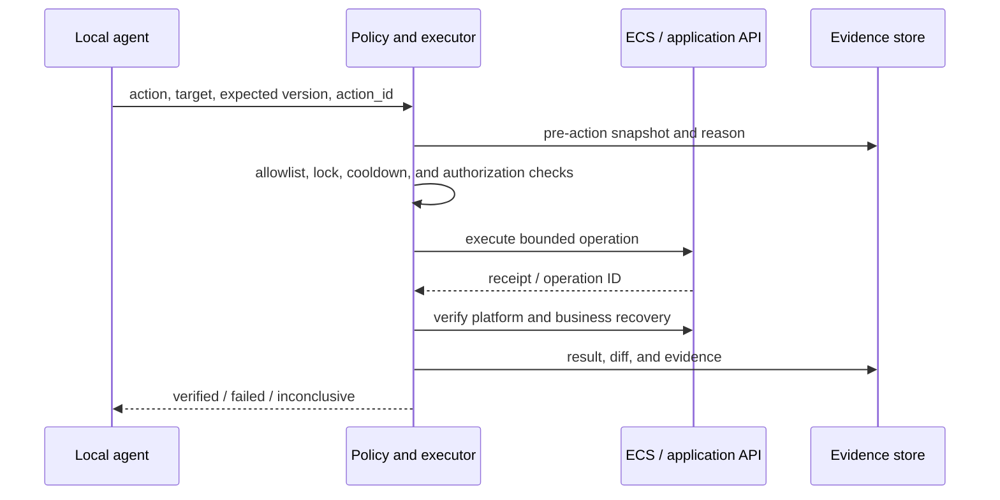

# EBO Fargate Migration and Local Diagnostic Agent Architecture Report

[中文](EBO_Fargate架构与诊断Agent调研报告.md) | [English](EBO_Fargate_Architecture_and_Local_Diagnostic_Agent_Report.en.md)

## 1. Conclusions and recommended design

Run **Ebo Engine and `realtime-assistant`** in one Linux Fargate task and let one ECS service maintain `desiredCount=1`. Keep Home Assistant on the local Windows machine as an optional management client. The core speech, frame selection, model session, and robot playback path does not depend on Home Assistant. Home Assistant still exposes device controls and the legacy TTS entry point, so it cannot be treated as a strictly read-only dashboard.

For the first phase, use **CloudWatch Container Insights with enhanced observability, `awslogs`, structured application events, and periodic health snapshots**. A local diagnostic agent should query metrics, logs, task state, and change history through AWS APIs and package them with provenance and bounded time windows. Routine changes should go through a separate allowlisted executor. Keep ECS Exec for supervised deep investigation. AWS DevOps Agent can supplement the local agent with AWS resource relationships and cloud-side investigation.

The business task does not initially need CloudWatch Agent, an ADOT Collector, and FireLens as three extra sidecars. AWS can collect basic container metrics and stdout/stderr without them. Application instrumentation is still required for business meaning: the platform cannot infer that playback lasted only 300 ms, a family member intentionally muted the microphone, or a false interruption cancelled a model response.[1][2][3]

| Decision | Recommendation | Reason |
|---|---|---|
| Cloud business containers | Engine + `realtime-assistant` | Matches the existing direct communication path |
| Home Assistant | Keep local; connect to cloud only when needed | Outside the assistant's critical path but still capable of writes |
| Fargate management unit | One task maintained by an ECS service | A standalone `RunTask` is not continuously reconciled |
| Base observability | Container Insights enhanced + `awslogs` | Works for both business containers without a host agent |
| Application observability | JSON events, periodic health summaries, a small set of EMF metrics | Preserves business causality and supports queries and alarms |
| Local delivery | Incremental API pull, supplemented by event notifications | Windows can catch up after being offline and needs no inbound home-network port |
| Agent writes | Allowlisted executor with version checks, rate limits, locks, and audit | Prevents stale, duplicated, or competing actions |
| AWS DevOps Agent | Read-only investigation first; enable mutations separately | Remote MCP/API integration exists, while modifications require explicit controls |
| Data retention | Preserve file semantics on EFS first; later archive to S3 and add explicit checkpoints | The application currently depends on appendable files and local paths |

### Evidence boundary

The code baseline came from `<source-workspace>` at verified Git revision `88b97a8e3c38469797d5e2eb89bc819bc6b30d1d`. Official sources were checked on 2026-09-09 in America/Toronto. The original analysis used static code, existing documentation, and allowlisted non-secret configuration fields. At that stage it did not connect to AWS, deploy, restart the local containers, or retest the robot. Experiment durations, sampling periods, and resource sizes in this report are starting points rather than performance guarantees.

The cloud boundary is `realtime-assistant` plus Ebo Engine; Home Assistant remains local. Having two business containers does not require the telemetry and control planes to run inside those containers.

## 2. Current system and actual dependencies

### 2.1 Responsibilities of the three services

| Component | Current responsibilities | Dependencies |
|---|---|---|
| `ebo-engine` | Vendor login, Agora media/control, internal MQTT, FFmpeg, MediaMTX, HTTP API, streaming talkback | Enabot Cloud, Agora, and several internal subprocesses |
| `realtime-assistant` | RTSP capture, OpenCV motion-based frame selection, model WebSocket session, audio playback bridge, transcripts, and memory logs | Engine RTSP, HTTP, and PCM WebSocket; OpenAI |
| `homeassistant` | Device entities, dashboard, camera view, device buttons, global microphone choice, and older vision/TTS experiments | Engine APIs/media; legacy experiments also use vision and TTS providers |

Engine is not a single-process container. Its path is `log_tee.py → run.sh`; the shell supervisor starts internal Mosquitto, one bridge per device, the panel, and optional MCP support. FFmpeg and MediaMTX participate in the media path. Container, subprocess, and business-path health therefore need separate observations: a `RUNNING` container can still contain a failed panel, bridge, or transcoder.

Mosquitto is the lightweight Eclipse Mosquitto MQTT broker. Code evidence: the original project's `compose.yaml`, [Engine startup and supervision](./ha-enabot/ebo/run.sh), and [Assistant initialization](./realtime-assistant/app.py).

### 2.2 Business communication is bidirectional

| Direction | Current address or protocol | Migration concern |
|---|---|---|
| Assistant → Engine | `rtsp://ebo-engine:8554/ebo` | Use localhost in one task; capture currently uses RTSP over TCP |
| Assistant → Engine | `http://ebo-engine:8098/api/robots` | Authenticated with `X-Enabot-Token`; queried roughly every five seconds for source-audio health |
| Assistant → Engine | `POST /api/cmd` | Carries wake, camera, and playback commands |
| Assistant → Engine | `ws://ebo-engine:8200/talk` | PCM streaming playback |
| Engine → Assistant | `http://realtime-assistant:8099/audio/...` | Reverse fetch for WAV fallback; easy to miss during migration |

The WAV fallback first creates an audio file, tells the robot that media is available, and lets the robot fetch the file over HTTP. A migration that preserves only the primary streaming route would silently break this fallback.

The relevant settings are `EBO_RTSP_URL`, `EBO_API_URL`, `EBO_TALK_STREAM_URL`, and `EBO_ASSISTANT_AUDIO_URL`. Some are configurable in code but were not all explicit in the former Compose environment list, so editing an old `.env` alone does not guarantee a runtime change. See [Assistant configuration parsing](./realtime-assistant/app.py) and its Engine API client.

### 2.3 Actual Home Assistant coupling

| Behavior | Evidence | Decoupling treatment |
|---|---|---|
| State polling | Native integration queries `/api/robots` every ten seconds | May remain optional and read-only; never make it a startup dependency |
| Device writes | Integration sends buttons and settings through `/api/cmd` | Separate dashboard and diagnostic-agent identities and record the caller |
| Global microphone choice | `microphone/set` changes robot audio and persists `ui_choices.json` | Preserve user intent; automated recovery must never unmute it |
| Legacy TTS | Home Assistant gives Engine a media URL in a `talk` command | A local URL requires cloud-to-home reachability; disable first or use short-lived cloud objects |
| Camera and legacy vision | Snapshot, preview, and manual image analysis | Keep as an optional local feature outside the Realtime dependency graph |
| Scheduled movement | `automations.yaml` declares forward actions at 00:30 and 12:30 | Explicitly retain or disable; do not dismiss it as dashboard presentation |
| Local operations scripts | Startup and tuning scripts check that the Home Assistant container runs | Remove this operational coupling from cloud deployment |
| Supervisor restart | Engine panel calls `http://supervisor/addons/self/restart` | Not a Fargate restart API; replace the control route |

The inspected `configuration.yaml` did not show `automation: !include automations.yaml`. The declaration exists, but that alone does not prove the automation was active. Diagnostic evidence must distinguish “declared in a file” from “loaded at runtime.” Supporting code includes the [HA coordinator](./ha-enabot/ebo/ha_integration/custom_components/ebo/coordinator.py), [media player](./ha-enabot/ebo/ha_integration/custom_components/ebo/media_player.py), and [Supervisor restart path](./ha-enabot/ebo/panel.py).

## 3. Fargate design and migration constraints

### 3.1 Recommended target topology

The controlled executor, evidence adapter, and structured business telemetry in this diagram describe the intended design; not every component already exists in this repository. “Task → EventBridge” represents ECS control-plane state-change events. Those remain available even when a process crashes before it can write a final log.[36]

Fargate requires `awsvpc`. Containers in the same task can communicate through localhost, so the initial internal media path needs neither an ALB, Service Connect, nor public ports.[4]

### 3.2 Port conflicts and address changes

Compose allowed Engine and Assistant to listen on the same internal port because host mappings separated the containers. Containers in one Fargate task share the network namespace; two processes cannot both bind `0.0.0.0:8099`. Changing only a port-mapping label cannot fix the process-level conflict.[4]

| Purpose | Address inside the task | Treatment |
|---|---|---|
| Engine API | `127.0.0.1:8098` | Preserve API port |
| Assistant health and WAV | `127.0.0.1:8099` | Preserve Assistant port |
| Engine panel | `8101` | Set `EBO_PANEL_PORT=8101` to isolate the unauthenticated panel |
| RTSP | `127.0.0.1:8554` | Set the Assistant RTSP URL explicitly |
| PCM WebSocket | `127.0.0.1:8200` | Set the talk-stream URL explicitly |
| WAV retrieval | `http://127.0.0.1:8099/audio` | Set `EBO_ASSISTANT_AUDIO_URL` explicitly |

The panel may continue to run on 8101 for internal diagnostics as long as the security group does not expose it. `EBO_API_HOST` also participates in advertised URLs: localhost is valid only inside the task and must not be published to local Home Assistant or a browser. A retained remote dashboard needs separate internal and client-reachable addresses, plus validation of RTSP, HLS, WHEP/WebRTC URLs and ICE candidates.

The Engine panel assumes Home Assistant Ingress provides authentication, while Assistant `/health` and `/audio/` have no independent access control. Do not convert every Compose port into a public security-group rule. The first phase can have no public ingress; local AWS API queries do not require a direct container connection. Add a VPN or authenticated private media gateway only if local preview remains necessary.

### 3.3 Images, networking, and runtime

Engine uses glibc Linux, the Agora Server SDK, and an amd64 MediaMTX download; Compose specifies `linux/amd64`. Keep Linux/x86_64 for the first migration. A Windows developer host does not imply Windows Fargate, and ARM should be a separate compatibility experiment. Store images in ECR and pin deployments to digests. Validate optional downloads and components because a successful image build does not prove FFmpeg, MediaMTX, or optional MCP behavior.

A private-subnet design must reach ECR, logs, Secrets Manager, EFS, and the external Enabot, Agora, and OpenAI services. VPC endpoints can replace some AWS-service traffic but cannot provide third-party internet egress. A NAT gateway is the common answer; an experimental public-subnet task with a public IP still needs closed ingress. Agora Server SDK 2.4.9 connectivity must be checked against its own vendor requirements and real tests rather than a browser WebRTC port table.

The initial sizing recommendation was **2 vCPU / 4 GiB**, followed by measurement-based reduction. It was an evaluation starting point, not a claim that the workload needed those resources. Include init/reaping, SIGTERM handling, SDK, FFmpeg, log buffers, and management processes in the budget.

Compose `/tmp` tmpfs cannot be copied directly because Fargate does not support that task-definition parameter. Use task ephemeral storage or an ordinary writable temporary directory. Fargate ephemeral storage disappears with the task; Linux platform 1.4.0 and later provide at least 20 GiB and allow configuration up to 200 GiB, with image layers consuming part of it.[5][6]

### 3.4 Only one owner may hold the device session

Existing project notes show that the vendor app can compete with Engine for device control. Cloud migration adds the risk that the Windows and cloud Engine run concurrently. The cutover must release the local session before cloud takeover; a parallel blue/green pair cannot be assumed safe.

`desiredCount=1` does not prevent two tasks during a normal rolling deployment. For the initial service, `minimumHealthyPercent=0` and `maximumPercent=100` create a deliberate stop-then-start maintenance window. This prevents overlap within that service but cannot police another computer, service, or vendor application.[7]

High availability would require per-device leases, ownership expiry, and proof that the prior connection has been released. Merely raising replica count creates contention. A/B experiments against the same physical robot must run sequentially.

## 4. Configuration and state preservation

### 4.1 Preserve the tuned configuration, not defaults

The following values were read from allowlisted local fields. They describe file contents rather than a fresh runtime verification.

| Setting | Local value at analysis time | Migration consequence |
|---|---|---|
| Engine AEC / NS / AGC | `true / false / false` | Do not reset to the former all-false Compose defaults |
| Assistant barge-in | `EBO_BARGE_IN_ENABLED=false` | Compose default was true; resetting changes conversation behavior |
| Model / voice | `gpt-realtime-2.1-mini / verse` | Freeze as the initial baseline and test model changes separately |
| Input denoise / VAD | `far_field / server_vad` | Preserve far-field behavior |
| VAD threshold / prefix / silence | `0.55 / 300 ms / 650 ms` | Do not tune during the first migration run |
| Motion cooldown | 3 seconds | Differs from the 12-second Compose default |
| Vision mode / auto wake | `context / true` | Affects proactive speech and device recovery |
| Source-media stale / startup grace | `20 / 45` seconds | Business thresholds, not direct ECS restart thresholds |
| Engine primary config | CN and `ebox.enabotserver.com` | Preserve region and configuration precedence |
| Engine old panel config | CA and North American endpoints | Treat as fallback; do not overwrite `options.json` |
| Engine video / idle | 720, 20 fps, 2500, ultrafast; idle 0 | Preserve media processing and always-on behavior |

Engine `run.sh` resolves common options as **`options.json` → `panel.json` → built-in defaults**. It also exports values from `options.json` over same-named environment values, so putting everything in ECS environment variables does not guarantee the effective configuration. If `options.json` is absent, the generated file is mainly account data and does not fully preserve CN/host, media, and idle settings. Migration should produce an explicit redacted resolved-configuration manifest with each value's source and applied result.

Passwords, vendor encryption parameters, the OpenAI key, and Engine API token belong in Secrets Manager or Parameter Store SecureString. Images, reports, and agent prompts must contain no values. ECS startup injection does not provide hot rotation: coordinate Engine and Assistant replacement and verify that old persistent files cannot override new secrets.[8]

### 4.2 Persistence inventory

| State | Current path | Migration rule |
|---|---|---|
| Engine configuration and token | `/data/options.json`, `panel.json`, `api_token` | Track source and secret version; avoid a random token that breaks Assistant authentication |
| Family control choices | `/data/ui_choices.json` | Preserve intentional global mute and similar choices |
| User transcripts | Assistant `/data/transcripts.jsonl` | Treat as protected family conversation content |
| Response index | `/data/assistant_outputs.jsonl` | Preserve response/item/stream and generation/playback relationships |
| Response WAV/TXT | `/data/replies/` | Media objects, not ordinary logs to send wholesale to a model |
| Dynamic-memory audit | `/data/logs/session-memory.jsonl` | Preserve sent/confirmed relationships; restrict access to text |
| Runtime logs | Engine `/data/logs/ebo-engine.log` and container output | Centralize cloud logs without double-ingesting mirrored stdout |

Separate EFS access points for the two services preserve the existing file API and reduce migration changes. Later, archive WAVs, old indexes, and experiment attachments to S3 and reduce recovery state to explicit checkpoints. S3 is not a drop-in appendable JSONL filesystem, and EFS should not become an unlimited media archive.[9]

An EFS volume on Fargate adds the AWS-managed `aws-fargate-supervisor` container, which consumes a small amount of task CPU and memory and appears in metadata and Container Insights. “Two containers” in this report means two business containers, not necessarily only two observed container records.[9]

**Keeping files does not guarantee complete session restoration.** The Assistant reloads recent disk conversation mainly during `unplanned_reconnect`; a fresh process does not automatically rehydrate all context merely because files exist. In-memory summaries, images, and incomplete audio can be lost. Task-replacement recovery needs separate acceptance criteria and must distinguish generated text from audio confirmed as played.

## 5. Separate infrastructure health from business health

### 5.1 Three health layers

| Layer | Question | Collection and treatment |
|---|---|---|
| Liveness | Are the main process, required workers, and critical subprocesses alive? | ECS container health check with bounded timeouts and failure thresholds |
| Readiness | Can the system currently hear, see, reach the model, and play audio? | Application health snapshots and business alarms |
| User intent | Is the microphone intentionally muted or the service in maintenance? | Separate desired state that suppresses inappropriate repair |

The existing aggregate `/health` combines model connectivity, media movement, and source-audio evidence. It describes Assistant availability but should not be used unchanged as the ECS service replacement trigger. Docker `restart: unless-stopped` also does not restart solely because a container is unhealthy, whereas ECS service behavior differs. Provide a distinct liveness check and retain `/health` for diagnosis. Because `/health` returns HTTP 200 even when its `ok` field is false, an HTTP-status-only probe misses failures.[10]

Represent deliberate mute as `intentionally_muted`, not a container fault. Represent an external model outage as `dependency_unavailable` and retry with backoff. Restart only when an internal worker or subprocess cannot recover. Panel liveness cannot stand in for bridge and media health.

The existing audio checks distinguish incoming source-packet growth from PCM decode callbacks, preventing synthesized silence from making RTSP appear healthy. Preserve this distinction. It still cannot prove intelligible speech, correct transcription, or audible speaker output; those require end-to-end tests.

### 5.2 What to collect from each container

| Observation | Source | Interpretation requirement |
|---|---|---|
| CPU and memory used/reserved | Enhanced Container Insights | Keep units and container dimensions; task averages are insufficient |
| Network and storage throughput | Container/task metrics | Shared-network runtime counters are not per-business-path traffic; avoid double counting |
| Ephemeral storage | `EphemeralStorageUtilized/Reserved`, metadata v4 | Include image use and temporary media |
| Task/container state, exit code, stop reason | ECS APIs and task-state events | Missing metrics after a stop are not zero load |
| Container restart count | `RestartCount` | Exists only with restart policy and differs from service task replacement |
| Unhealthy state | `UnHealthyContainerHealthStatus` | Requires a task-definition health check |
| Engine audio source | `/api/robots.audio_health` | State, packet/PCM age, received count, and RTC connection |
| Assistant media | `/health` frame age, audio age, and source status | Separate bytes flowing, a valid source, and collector failure |
| Model connection | Session age, rollover, and unexpected reconnect values | Count expected rotation separately from failure |
| Playback and interruption | Stream state, played ms, fallback/failure and barge-in counters | Correlate with the response, not only generation success |
| Business quality | Time to first audio, completion rate, false cancellation, ASR/response failures | Incomplete today; add events and controlled tests |

Metric names and limitations follow the enhanced-observability tables.[1] A task can use `ECS_CONTAINER_METADATA_URI_V4` to enrich events with identity and high-frequency statistics, but that link-local endpoint is not an API the Windows agent can call.[11]

Emit a redacted health summary every 15–30 seconds and immediately on state transitions. Temporarily raise media-failure sampling to 1–5 seconds with an automatic expiry. CloudWatch infrastructure metrics are commonly analyzed at minute scale; polling every second cannot create missing source resolution.

A small EMF set can include `SourceAudioAvailable`, `RealtimeConnected`, `VideoFrameAgeSeconds`, `SpeakerFailureCount`, and `UnexpectedReconnectCount`. Keep dimensions to environment, service, and a bounded device group. Put `session_id`, `response_id`, and `experiment_id` in event fields. Every EMF dimension combination creates a metric, so high cardinality raises cost; extraction can also duplicate data and is not an audit ledger.[3]

## 6. Turn logs into evidence an LLM can diagnose

### 6.1 Existing foundation and gaps

| Existing mechanism | Value | Gap |
|---|---|---|
| Engine `log_tee.py` mirrors stdout to a rotating file | Retains local runtime output | Cloud collection of both sources duplicates records |
| Engine `ebo_log.py` custom output | Suppresses SDK noise | Time-of-day only; broad logging suppression means some evidence never exists |
| Assistant text logs | Connection, error, media, and playback events exist | No uniform schema or cross-service/experiment identity |
| Transcript/output/memory JSONL | Item, response, stream, and injection relationships exist | Contains family text and is not all safe for an operations model |
| Rich `/health` response | Useful current snapshot | Cannot reconstruct a past incident if never persisted |

CloudWatch Agent and FireLens cannot recover SDK data discarded in source code. Emit necessary SDK failures as rate-limited structured events. Enable deep SDK logging only for a bounded investigation and disable it automatically rather than permanently ingesting noise.

Send stdout/stderr through `awslogs` first. It does not scan `/data/*.jsonl` or `/data/replies`; file evidence must be represented by redacted application events, an explicit archive, or a dedicated file collector.[2]

Use non-blocking log mode and bounded buffers on the realtime path so a CloudWatch outage cannot stall audio. The tradeoff is loss when a buffer fills or a task crashes. Store critical experiment results and action audit records separately, expose evidence gaps, and do not promise lossless telemetry.[12]

### 6.2 Recommended event contract

Use OpenTelemetry log concepts—event and observed times, severity, resource, event name, attributes, and real trace/span IDs when available. A compact single-line JSON envelope is sufficient; the LLM does not need the entire OTLP representation.[13]

| Field group | Suggested fields | Purpose |
|---|---|---|
| Time and version | `schema_version`, `timestamp`, `observed_timestamp` | UTC event/collection times and schema evolution |
| Resource identity | `service.name`, `service.version`, `environment`, `task_arn`, `container_name`, `process_instance_id` | Distinguish process generations |
| Event | `event_id`, `event_name`, `severity`, `message`, `component` | Stable machine filtering and readable detail |
| Business correlation | Device pseudonym, `session_id`, `response_id`, `item_id`, `stream_id`, `injection_id` | Follow input through generation, playback, and memory confirmation |
| Trace correlation | `trace_id`, `span_id` | Populate only when actual instrumentation produced them |
| Configuration and experiment | `config_version`, `config_hash`, `experiment_id`, `action_id` | Tie changes to outcomes |
| Result | `status`, `reason_code`, `retryable`, `duration_ms`, `error.type` | Classify failures and recovery |
| Playback proof | `generated_ms`, `played_ms`, `interrupted`, `fallback_used` | Separate generated, submitted, and observed playback |
| Quality and provenance | `source_ref`, `redacted`, `truncated`, `sampling_policy` | Prevent missing or sampled data from appearing complete |

Useful names include `engine.rtc.disconnected`, `engine.audio_source.changed`, `assistant.realtime.connected`, `assistant.session.rotated`, `speaker.stream.finished`, `speaker.stream.interrupted`, `memory.injection.sent`, `memory.injection.confirmed`, `config.applied`, and `diagnostic.action.finished`.

Do not log every 20 ms audio block. Log transitions, errors, one summary per response, and low-frequency heartbeats. Correlate long WebSocket sessions while bounding each response, reconnect, and playback operation. RTSP, PCM, and native SDK behavior does not become a complete distributed trace merely because auto-instrumentation is installed.

### 6.3 Give the model a diagnostic package, not the entire log corpus

| Artifact | Content |
|---|---|
| `manifest.json` | Incident ID, device pseudonym, window, sources, schema, missing items, checksums |
| `topology.json` | Services, dependencies, task and image identities |
| `health.jsonl` | Raw health snapshots and intent state in the window |
| `metrics.json` | Metrics, dimensions, units, period, aggregation, and missing values |
| `events.jsonl` | Time-ordered application, ECS, deployment, and control events |
| `config-diff.json` | Redacted desired/effective configuration and before/after differences |
| `evidence-index.json` | Log group/stream/event ID, object versions, and query parameters |
| `analysis.md` | Hypotheses, supporting and contradicting evidence, and next experiment |

These filenames describe a future interface; the original architecture report did not create real incident data. Start with a five-to-fifteen-minute summary around the fault, then fetch original detail by response or event ID. “No error logs” must state whether collection ran, sampling applied, or a gap exists.

Family transcripts, prompt text, memory content, and audio should be excluded from ordinary diagnostic packages. Prefer lengths, hashes, event IDs, technical audio statistics, and object references. Fetch the minimum content only for a specifically authorized investigation. Treat all log text as untrusted data rather than instructions to the model.

## 7. Reliably deliver cloud evidence to Windows

### 7.1 First phase: persist in AWS and pull incrementally

Run a deterministic local adapter for credentials, pagination, windows, cache, and redaction. The LLM invokes bounded tools such as `get_target_state`, `get_metrics`, `query_events`, `get_evidence`, and `get_config_diff`; it does not receive an arbitrary AWS CLI shell.

| Data | Read path | Local treatment |
|---|---|---|
| Container/task state | ECS ListTasks, DescribeTasks, DescribeServices | Persist task ARN, deployment generation, and stop reason |
| Metric history | CloudWatch GetMetricData | Batch reads with units, statistics, and missing values |
| Raw logs | CloudWatch Logs FilterLogEvents | Bounded windows, complete pagination, event-ID deduplication |
| Aggregate queries | Logs Insights StartQuery/GetQueryResults | Limit window and scanned scope; retain query ID |
| Stop/deploy/alarm events | EventBridge → SQS and local long polling | Acknowledge after local persistence; retry and deduplicate |
| Media/experiment artifacts | Selected S3 objects | Fetch only named objects and validate version/hash |

`FilterLogEvents` may return an empty page with a `nextToken`; continue until pagination is complete. Tokens are not durable incremental cursors. Persist processed windows and event IDs and overlap windows to receive late arrivals. If log transformation is enabled, the API returns the pre-transformation record, so local consumers cannot assume cloud transformation already redacted it.[14][15]

An initial target is log pulls every 10–30 seconds and metric pulls every 60 seconds, with narrower windows during an incident. Measure `observed_timestamp - timestamp`; the targets are design goals rather than AWS delivery SLAs.

SQLite plus compressed JSONL is suitable for the rebuildable local cache, cursors, queries, and evidence index. Cloud storage owns retention. Windows sleep should not erase monitoring evidence, and the UI must distinguish “online and quiet” from “offline and unsynchronized.”

### 7.2 When to add a push path

CloudWatch Logs subscriptions deliver to supported targets such as Lambda, Kinesis Data Streams, and Firehose; they do not push directly to a home PC, and CloudWatch Logs → SQS is not a direct subscription shape. A queue design can use **subscription → Lambda normalization → SQS**, followed by local pull. High-volume raw logs can use a stream processor or S3 archive.[16]

Handle duplicate delivery, retries, retention, and dead letters, while relying on the cloud archive to repair gaps. Do not promise exactly-once or infinite retries. At this scale, API pull is easier to maintain; start with ECS and alarm events in a queue.

Live Tail is an operator view, not the permanent agent feed: sessions last at most three hours, results over 500 matching events/second are sampled, only Standard log class is supported, and use is billed by session time. Long-lived automation needs historical reads with durable local state.[17]

### 7.3 Local identity and networking

Interactive work can use IAM Identity Center or short-lived STS credentials. A resident process needs renewable credentials or a controlled machine identity rather than a permanent administrator access key. Separate read and action roles. AWS API reads require no inbound Windows port and no exposed container panel.

For business health, either have the application emit periodic health events through `awslogs`, or later deploy a private in-VPC collector that polls `/health`. If the business task must stay at two containers and infrastructure should remain small, emit application events. The current on-demand `/health` endpoint alone cannot reconstruct historical readiness.

## 8. How the local agent controls the target

### 8.1 Precise meanings of “restart”

| Target | Mechanism | Effect and limit |
|---|---|---|
| Recover an exited container | ECS container `restartPolicy` | Supported on Fargate Linux; depends on ignored exit codes and minimum successful runtime |
| Reset one stuck application connection | Controlled application reset/reconnect endpoint | Future capability; Assistant currently has no such management API |
| Replace a whole task | `StopTask`, then service reconciliation | Interrupts both business containers; a standalone task is not replenished |
| Start a service deployment | `UpdateService(forceNewDeployment)` | Replaces tasks according to deployment policy; not an Assistant-only restart |
| Apply image/configuration | New task-definition revision plus UpdateService | Effective only in a new task; application parsing still needs verification |
| Inspect process/files | ECS Exec | Supervised diagnostic channel, not a routine restart protocol |

ECS restart policy handles process exits; it is not a general remote equivalent of `docker restart`. An unhealthy but still-running process, an ignored exit code, or a rapid failure can behave differently.[18][19][20]

Engine `/api/restart` addresses Home Assistant Supervisor, which does not exist on Fargate. Assistant exposes health and audio GET routes but no prompt hot-reload or administrative actions. Proposed tools must not be described as existing capabilities.

One shared task means an Assistant image or environment change normally replaces Engine too. Frequent prompt changes with uninterrupted device ownership require a controlled hot-reload/session-reset feature. Fully independent deployment requires separate services/tasks. Container restart policy does not solve configuration deployment independence.

### 8.2 Recommended action flow

The first executor can be a deterministic local program around the AWS SDK. Move it to API Gateway/Lambda/Step Functions only when actions must continue while Windows is offline or several agents coordinate. The business task should not possess broad ECS-management permissions.

| Identity | Permission scope | Explicitly outside its role |
|---|---|---|
| Task execution role | Image pull, startup secret injection, `awslogs` | Arbitrary cloud actions at runtime |
| Task role | Named S3/EFS access and any required Exec channel permissions | Cluster-wide management |
| Local read role | Named log groups, metrics, and ECS status | Resource mutation or unrestricted family-media reads |
| Action role | Named service/task and approved deployment actions | IAM management, unrestricted secrets, arbitrary shell |
| DevOps Agent investigation/elevated roles | Investigation reads and separately approved modifications | Automatic inheritance of local-agent authority |

Both business containers share the task role security boundary. If they require strictly isolated runtime AWS identities, splitting the task becomes a structural requirement.[37][38]

An action request should include exact resource ARN, device pseudonym, action kind, `action_id`, expected task-definition/configuration version, reason, deadline, expected result, and rollback target. Resolve the target again immediately before execution. An `action_id` field alone does not make an AWS API idempotent; the executor must persist idempotency.

Start with diagnostic-package capture, health reads, model-session reconnect, bounded media recovery, task replacement, and switching to an approved configuration. Global mute, movement, laser, and other household-device actions belong to a different permission domain. Enforce a per-device mutex, retry budget, and cooldown; if ECS is already replacing a task, wait and observe.

### 8.3 Role of ECS Exec

ECS Exec uses SSM Session Manager and needs no SSH port. Configure it for new tasks with IAM and network restrictions by task, container, and tag; an already-running task cannot simply be retrofitted. Commands run as root, so a prompt cannot enforce command safety. If enabled, narrow it behind controlled tools and audit.[21]

CloudTrail records the caller, while command output requires separate CloudWatch/S3 configuration and image utilities such as `script` and `cat`. Exec also has read-only-root-filesystem constraints. Use it for supervised process/file inspection, not five-second health polling or permanent arbitrary LLM shell access.[21]

### 8.4 CloudTrail alone is not the audit log

CloudTrail records AWS API operations but not the full meaning of private application commands. Engine `/api/cmd` logs suffix/payload without caller identity; earlier incident material could not identify which UI issued a mute command.

Add caller, source client, action ID, redacted arguments, target configuration version, acceptance time, execution result, and device acknowledgement at the application or management boundary. HTTP 200 proves only request acceptance, not playback or recovery. Local and AWS agents must share the same action journal and locks.

## 9. Choosing common industry components

| Component | What it solves | Recommendation here |
|---|---|---|
| CloudWatch Logs/Metrics/Alarms | AWS-native collection, query, and alarms | Primary first-phase platform |
| Container Insights enhanced | ECS task/container resource visibility | Enable first; it does not provide business semantics |
| OpenTelemetry | Cross-language log, metric, and trace semantics | Long-term event contract and tracing direction |
| ADOT Collector | Receive, process, batch, and export OTel telemetry | Add for tracing, more services, or common export |
| CloudWatch Agent | File/custom telemetry and ECS Application Signals path | Deploy only for a defined need; it is not a Fargate host installer |
| FireLens + Fluent Bit | Complex parsing, redaction, and multi-destination routing | Add when legacy text or multi-sink routing justifies it |
| Prometheus/Grafana stack | Independent metric storage and visualization | No current need to operate a separate stack |
| MCP | Typed query/action tools for agents | Tool boundary, not storage, queue, or authorization system |

ECS Application Signals distinguishes a CloudWatch Agent sidecar, which supports Fargate, from the EC2 daemon strategy, which does not. Do not copy an “agent per host” EC2 installation pattern to Fargate.[22]

ADOT supports an ECS sidecar and a separate Collector service. If the business task must contain only two user-defined containers, a private TLS Collector service can receive OTLP while applications set correct resource attributes. An external collector cannot automatically read target-task `/data` files or localhost metadata.[23][24]

If a third user-defined container becomes acceptable, select one collector for a concrete requirement. Do not add CloudWatch Agent, ADOT, and FireLens merely to claim logs, metrics, and traces. FireLens needs its own log-router container and adds buffering, failure, and resource considerations; it still cannot invent response/stream causality.[25]

## 10. Integrating AWS DevOps Agent

### 10.1 A different layer from CloudWatch Agent

CloudWatch Agent is a collector. AWS DevOps Agent is an investigation and operations reasoning service. The collector does not decide repairs; DevOps Agent does not replace application instrumentation. CloudWatch should hold facts, both diagnostic agents should read the same facts, and an explicit policy layer should own execution.

AWS DevOps Agent supports remote MCP and APIs. A local custom agent can call the regional MCP endpoint with an Agent Space token or SigV4, so the local agent does not need to move into AWS. Calling remote MCP means the local agent calls AWS DevOps Agent; registering a custom MCP server means AWS DevOps Agent calls project tools. These are opposite directions.[26][27]

### 10.2 Recommended integration steps

1. Create a dedicated EBO Agent Space scoped to the relevant account and resources, with CloudWatch and suitable resource relationships.
2. Provide redacted architecture, an error dictionary, dependency map, configuration-version rules, and runbooks. Explain intentional mute, exclusive Engine ownership, and that task replacement affects both services.
3. Have the local agent collect the incident window, task ARN, configuration diff, and symptoms before starting an AWS investigation. Correlate the investigation/chat ID with the local incident ID.
4. Offer a read-only EBO diagnostic MCP for health history, playback summaries, and configuration differences that AWS topology alone cannot express.
5. Reconcile AWS findings with project evidence before entering the controlled action flow. Return `inconclusive` when evidence is insufficient instead of choosing “restart and see.”

Custom MCP integration requires Streamable HTTP and a supported authentication method. Private connectivity can let an Agent Space reach tools in a VPC. If evidence already lives in CloudWatch or S3, the cloud agent need not call back into a home computer.[28][29]

### 10.3 Mutations exist but are not unrestricted automation

AWS documentation added directed actions on 2026-08-25. They are disabled by default, require Agent Space capability configuration and a per-account elevated role, depend on correct tool classification, and require operator approval for each modifying action. Supported-service and safeguard limits still apply; deletion and actions requiring `iam:PassRole` can be restricted. Do not assume the service can execute every project-specific `RunTask` or deployment workflow.[30][31]

Use directed-action approval for human-assisted repair. Use a separate deterministic executor and its own authorization for pre-authorized diagnostic experiments. Never imitate an operator approval. Both paths write to the same action audit.

The MCP connection guidance emphasizes read-only tools while newer directed-action guidance describes mutations. Keep readers read-only; mark writers `MUTATIVE` and isolate their credentials. Successful registration is not proof of safe classification. The repository's `ebo_mcp.py` exposes movement, wake, return-to-base, laser, and speech and was locally disabled with `mcp=false`; do not expose it wholesale as cloud operations tooling.

### 10.4 Region and documentation freshness

Use the Supported Regions page as the source of truth. Its checked version included Canada Central even though older tutorials still described six regions. The Agent Space and workload may occupy different regions, subject to data residency, cross-region reads, and feature availability.[32]

Choose the workload region using measured EBO/vendor-to-AWS and AWS-to-model paths. A Windows machine in Canada does not mandate Canada, and a CN vendor configuration does not mandate an AWS China region. Compare candidate commercial regions with identical tests, egress, data boundaries, and service availability.

## 11. Close the loop on diagnosis and tuning

### 11.1 Fixed experiment record

Bind every experiment to the code commit, both image digests, task-definition revision, configuration version, device/SDK information, experiment ID, action ID, fault window, input, sampling policy, evaluation metrics, and rollback target. Record expected, container-start, application-resolved, and externally confirmed parameters rather than only the `.env` text.

Use **baseline → one change → identical input → observe → keep or roll back**. Test migration, AEC/NS/AGC, VAD, interruption, and model replacement separately. Real-device comparison runs must be sequential; offline media replay and synthetic input can run in isolation without competing for the production robot session.

The current application does not contain a complete offline replay harness, experiment manager, controlled hot reload, or cross-task checkpoint. Installing an agent framework does not provide those capabilities.

### 11.2 Fault experiments for this project

| Scenario | Required evidence | Correct conclusion/action |
|---|---|---|
| Intentional mute | Desired state, `source_audio_status=muted`, control audit | Show intentional unavailability; do not unmute or loop replacements |
| RTSP moves but no source packets | `transport=true`, `source=false`, packet/PCM age | Investigate Engine upstream/vendor session before changing prompts |
| CPU causes media backlog | Per-container CPU, frame age, encode/decode queue, timeline | Validate resource/transcode bottleneck and compare latency/drop rate |
| Model disconnect | Healthy Engine, reconnect events, session/memory confirmation | Recover only the model session and verify restored content |
| Response generated but barely played | Response/stream IDs, generated/played ms, cancel/truncate | Separate interruption, transport, fallback, and persistence causes |
| Engine subprocess exit | Exit code/signal, supervisor action, container state | Verify internal recovery; `RUNNING` is not acceptance |
| Whole-task replacement | ECS stop event, old/new task ARN, privacy state, files | Preserve state with no overlapping Engine; test session recovery separately |
| Windows returns after offline period | Cloud continuity, cursor, late and duplicate counts | Backfill evidence without restarting business services |
| Log egress congestion | Buffer/drop counters, business latency, collection-gap flag | Keep audio alive and report incomplete evidence |
| Configuration sent but unconfirmed | Config/injection ID and sent/confirmed state | Do not claim success or mix samples from different versions |

### 11.3 Acceptance thresholds

Run at least 24 hours, one network interruption and recovery, one task rebuild, one Windows-offline catch-up, and a fixed-phrase generation-to-playback check. Cross the application's normal session-rotation interval and observe cumulative failure rates instead of inspecting one green minute after startup.

Every action should end as `verified`, `failed`, or `inconclusive` within an agreed observation window. If infrastructure recovers without playback evidence, record “base path recovered; actual listening not confirmed.” The diagnostic loop is complete only when the local agent can cite each fact, identify missing evidence, return to the prior version, and stop when the retry budget is exhausted.

## 12. Phased delivery and cost control

| Phase | Scope | Exit criterion |
|---|---|---|
| 0: Freeze baseline | Containers, precedence, media/privacy state, candidate regions | Clear migration, preservation, and rollback description |
| 1: Basic cloud runtime | ECR, ECS service, localhost ports, EFS/Secrets, egress | Main path works without HA; old Engine no longer competes |
| 2: Historical visibility | `awslogs`, Container Insights, health and ECS events | Both containers' evidence can be queried and backfilled on Windows |
| 3: Read-only diagnostic agent | Bounded tools, package, config diff, AWS DevOps Agent | Explains common faults with cited evidence and marks gaps |
| 4: Controlled actions | Allowlist, lock/idempotency, audit, rollback, verification | No duplicate action or privacy override; stops on failure |
| 5: Experiments and tracing | Bounded OTel, on-demand collector, offline replay, checkpoints | Reproducible tuning that separates model, media, and infrastructure |

Major costs are continuous Fargate CPU/memory, NAT and data processing/transfer, EFS/S3, CloudWatch ingestion/query/metrics, DevOps Agent investigations, and model use. At this scale, high-cardinality logs, long Live Tail sessions, continuous preview video, and NAT can be material. Without measured volume, do not present false precision.[33][34][35]

Start with 14–30 days of runtime logs and longer retention for selected incident packages. Family media and conversation need an independent retention policy. Measure daily log GB per service, media size per response, metric dimension combinations, query scan volume, task hours, and network traffic before forecasting.

For interpretable experiments, do not simultaneously upgrade Agora SDK, MediaMTX, model, and audio algorithms. Migrate the known behavior first and optimize from measurements.

### Confirmed boundary and remaining decisions

1. The two cloud business containers are Engine and `realtime-assistant`.
2. Decide which Home Assistant writes, previews, and legacy TTS paths remain and whether AWS may reach the home network.
3. Define acceptable interruption for real-device deployment/rebuild and whether Assistant updates must avoid Engine disconnects.
4. Confirm region, family-content retention, and the exact actions a local agent may execute automatically.

These decisions do not block the base design, but they determine whether a third collector, separate Collector service, hot reload, or separate tasks are necessary.

## 13. Sources and evidence index

### Official sources

These pages were checked on 2026-09-09. Undated documentation is continuously maintained and should be rechecked for the target region and version before implementation.

1. AWS CloudWatch, [Amazon ECS Container Insights with enhanced observability metrics](https://docs.aws.amazon.com/AmazonCloudWatch/latest/monitoring/Container-Insights-enhanced-observability-metrics-ECS.html) and [ECS Container Insights setup](https://docs.aws.amazon.com/AmazonCloudWatch/latest/monitoring/deploy-container-insights-ECS-cluster.html).
2. AWS ECS, [Send Amazon ECS logs to CloudWatch](https://docs.aws.amazon.com/AmazonECS/latest/developerguide/using_awslogs.html).
3. AWS CloudWatch, [Embedding metrics within logs](https://docs.aws.amazon.com/AmazonCloudWatch/latest/monitoring/CloudWatch_Embedded_Metric_Format.html).
4. AWS ECS, [Fargate task networking](https://docs.aws.amazon.com/AmazonECS/latest/developerguide/fargate-task-networking.html).
5. AWS ECS, [Task definition differences for Fargate](https://docs.aws.amazon.com/AmazonECS/latest/developerguide/fargate-tasks-services.html).
6. AWS ECS, [Fargate task ephemeral storage](https://docs.aws.amazon.com/AmazonECS/latest/developerguide/fargate-task-storage.html).
7. AWS ECS, [Service definition parameters](https://docs.aws.amazon.com/AmazonECS/latest/developerguide/service_definition_parameters.html).
8. AWS ECS, [Pass sensitive data to a container](https://docs.aws.amazon.com/AmazonECS/latest/developerguide/specifying-sensitive-data.html).
9. AWS ECS, [Use Amazon EFS volumes](https://docs.aws.amazon.com/AmazonECS/latest/developerguide/efs-volumes.html).
10. AWS ECS, [Determine task health using container health checks](https://docs.aws.amazon.com/AmazonECS/latest/developerguide/healthcheck.html).
11. AWS ECS, [Task metadata endpoint v4 for Fargate](https://docs.aws.amazon.com/AmazonECS/latest/developerguide/task-metadata-endpoint-v4-fargate.html).
12. AWS ECS, [LogConfiguration](https://docs.aws.amazon.com/AmazonECS/latest/APIReference/API_LogConfiguration.html).
13. OpenTelemetry, [Logs Data Model](https://opentelemetry.io/docs/specs/otel/logs/data-model/).
14. AWS CloudWatch Logs, [FilterLogEvents](https://docs.aws.amazon.com/AmazonCloudWatchLogs/latest/APIReference/API_FilterLogEvents.html).
15. AWS CloudWatch, [GetMetricData](https://docs.aws.amazon.com/AmazonCloudWatch/latest/APIReference/API_GetMetricData.html).
16. AWS CloudWatch Logs, [Log group-level subscription filters](https://docs.aws.amazon.com/AmazonCloudWatch/latest/logs/SubscriptionFilters.html).
17. AWS CloudWatch Logs, [Live Tail](https://docs.aws.amazon.com/AmazonCloudWatch/latest/logs/CloudWatchLogs_LiveTail.html).
18. AWS ECS, [Container restart policies](https://docs.aws.amazon.com/AmazonECS/latest/developerguide/container-restart-policy.html).
19. AWS ECS, [StopTask](https://docs.aws.amazon.com/AmazonECS/latest/APIReference/API_StopTask.html).
20. AWS ECS, [UpdateService](https://docs.aws.amazon.com/AmazonECS/latest/APIReference/API_UpdateService.html).
21. AWS ECS, [Monitor containers with ECS Exec](https://docs.aws.amazon.com/AmazonECS/latest/developerguide/ecs-exec.html).
22. AWS CloudWatch, [Enable Application Signals on ECS](https://docs.aws.amazon.com/AmazonCloudWatch/latest/monitoring/CloudWatch-Application-Signals-Enable-ECSMain.html).
23. AWS Distro for OpenTelemetry, [Setting up ADOT Collector in ECS](https://aws-otel.github.io/docs/setup/ecs/).
24. AWS Distro for OpenTelemetry, [Collector deployment types](https://aws-otel.github.io/docs/getting-started/collector/sidecar-vs-service/).
25. AWS ECS, [Route logs to FireLens](https://docs.aws.amazon.com/AmazonECS/latest/developerguide/firelens-taskdef.html).
26. AWS DevOps Agent, [Accessing DevOps Agent](https://docs.aws.amazon.com/devopsagent/latest/userguide/working-with-devops-agent-accessing-devops-agent-index.html).
27. AWS DevOps Agent, [Connect to remote servers](https://docs.aws.amazon.com/devopsagent/latest/userguide/accessing-devops-agent-connect-to-devops-agent-remote-servers.html).
28. AWS DevOps Agent, [Connecting MCP Servers](https://docs.aws.amazon.com/devopsagent/latest/userguide/configuring-integrations-and-knowledge-connecting-mcp-servers.html).
29. AWS DevOps Agent, [Connecting to privately hosted tools](https://docs.aws.amazon.com/devopsagent/latest/userguide/configuring-integrations-and-knowledge-connecting-to-privately-hosted-tools.html).
30. AWS DevOps Agent, [Working with directed actions](https://docs.aws.amazon.com/devopsagent/latest/userguide/working-with-devops-agent-working-with-directed-actions.html).
31. AWS DevOps Agent, [What's new](https://docs.aws.amazon.com/devopsagent/latest/userguide/whats-new.html), including the 2026-08-25 directed-actions update.
32. AWS DevOps Agent, [Supported Regions](https://docs.aws.amazon.com/devopsagent/latest/userguide/about-aws-devops-agent-supported-regions.html).
33. AWS, [Fargate Pricing](https://aws.amazon.com/fargate/pricing/).
34. AWS, [CloudWatch Pricing](https://aws.amazon.com/cloudwatch/pricing/).
35. AWS, [DevOps Agent Pricing](https://aws.amazon.com/devops-agent/pricing/).
36. AWS ECS, [Task state change events](https://docs.aws.amazon.com/AmazonECS/latest/developerguide/ecs_task_events.html).
37. AWS ECS, [Task IAM role](https://docs.aws.amazon.com/AmazonECS/latest/developerguide/task-iam-roles.html).
38. AWS ECS, [Task execution IAM role](https://docs.aws.amazon.com/AmazonECS/latest/developerguide/task_execution_IAM_role.html).

### Project evidence

Project conclusions follow code and the configuration current at the time of analysis. Older planning documents can differ from the later streaming-playback implementation; historical tests are context rather than a claim that this report reran them.

| Evidence | Use |
|---|---|
| [README](README.md) | Service relationships, current deployment, persistence, operations |
| Compose source in the original workspace | Containers, ports, mounts, environment, health checks |
| [Assistant program](realtime-assistant/app.py) | APIs, state, playback, configuration, logging, recovery |
| [Engine Dockerfile](ha-enabot/ebo/Dockerfile) | SDK, glibc, architecture, optional build dependencies |
| [Engine `run.sh`](ha-enabot/ebo/run.sh) | Configuration precedence, subprocesses, optional HA path |
| [Engine bridge](ha-enabot/ebo/ebo_bridge.py) | Device state, privacy choices, audio status |
| Original audio-health and session-memory notes | Silence injection, packet/decode evidence, memory send/confirm behavior |
| Original Realtime parameter notes | Configuration groups and application semantics |
| Original Chinese architecture/audio `.docx` | Architecture, codecs, recovery, and logging boundaries; no English copy required by repository policy |
| Original scripts | Applied audio settings and local prompt-reload operational dependencies |

Only migration-relevant non-secret allowlisted fields were inspected from `.env`, `ebo-data/options.json`, and `ebo-data/panel.json`. Secret values, family recordings, and conversation text were not copied into this report.
