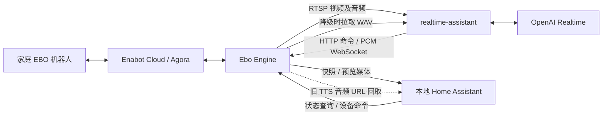
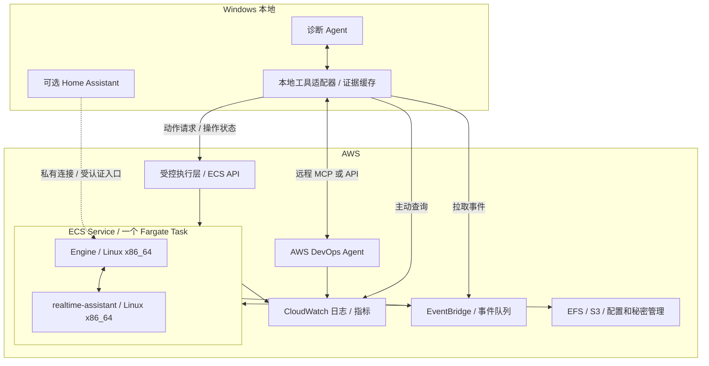
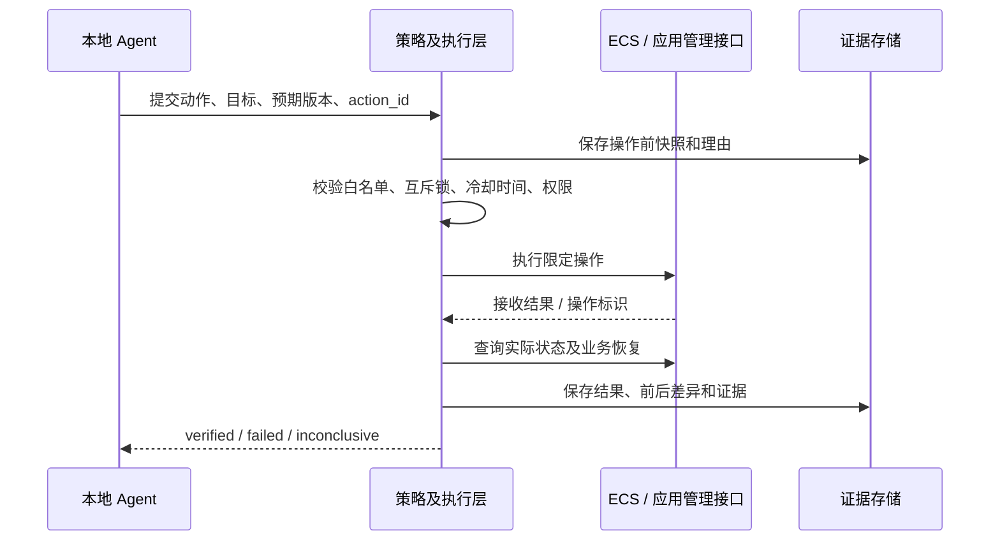

# EBO Fargate 迁移与本地诊断 Agent 架构报告

[中文](EBO_Fargate架构与诊断Agent调研报告.md) | [English](EBO_Fargate_Architecture_and_Local_Diagnostic_Agent_Report.en.md)

## 1. 结论与推荐方案

建议将 **Ebo Engine 与 realtime-assistant** 放入同一个 Linux Fargate Task，由一个 ECS Service 维持 `desiredCount=1`。Home Assistant 留在 Windows 本地，成为可选的管理客户端。核心语音、选帧、模型会话与机器人播放链路不依赖 Home Assistant；它仍有设备控制和旧 TTS 入口，不能按完全只读的 Dashboard 处理。

首期采用 **CloudWatch Container Insights enhanced + awslogs + 结构化应用事件/健康快照**。本地诊断 Agent 通过 AWS API 查询指标、日志、任务状态和变更记录，把它们组织成带来源和时间范围的诊断包。常规控制通过独立的、限定动作的执行层完成；ECS Exec 保留为人工深入排错通道。AWS DevOps Agent 作为云侧调查能力接入本地 Agent，补充 AWS 资源关系和故障分析。

这个方案不要求在业务 Task 中先加入 CloudWatch Agent、ADOT Collector、FireLens 三种采集容器。基础容器指标和 stdout/stderr 日志可以由 AWS 原生能力采集。业务健康历史和跨服务语义仍需要后续补充埋点；云平台不会自动知道“播放只进行了 300 毫秒”“家人主动关麦”“错误插话取消了模型回答”。[1][2][3]

关键决策如下。

| 决策 | 建议 | 主要原因 |
|---|---|---|
| 云端业务容器 | Engine + realtime-assistant | 与现有直接通信链路一致 |
| Home Assistant | 留本地，可选连接云端 | 不在实时助手主链路中，但保留操作行为 |
| Fargate 管理单位 | ECS Service 下的一个 Task | 单独 RunTask 不等于持续维持服务 |
| 基础观测 | Container Insights enhanced + awslogs | 两个业务容器即可接入，无需自管宿主机采集器 |
| 应用观测 | JSON 事件、定期健康摘要，少量 EMF 指标 | 保留业务因果关系，可查询、可告警 |
| 本地接收 | API 增量拉取为主，事件通知为辅 | Windows 关机后可补拉，不要求家庭网络开放入站端口 |
| Agent 写操作 | 白名单执行层，版本校验、限流、审计 | 防止误操作、重复执行和多 Agent 竞争 |
| AWS DevOps Agent | 首期接入只读调查；修改能力单独启用 | 支持远程 MCP/API，已具备受控修改能力，但存在审批和动作限制 |
| 数据保留 | 初期 EFS 保留文件语义；后续 S3 存档、显式检查点 | 当前程序依赖可追加文件和本地路径 |

### 证据边界

代码基线为本地项目 `<source-workspace>`，读取到的 Git HEAD 为 `88b97a8e3c38469797d5e2eb89bc819bc6b30d1d`。官方资料核对日期为 2026-09-09（America/Toronto）。本报告基于静态代码、现有文档以及配置白名单字段；未连接 AWS 账户、未部署、未重启本地容器、未重新实测机器人。文中的试验时长、采样周期和资源规格均是建议起点，不是已经验证的性能承诺。

部署边界已经确认为 Realtime Assistant + Ebo Engine；Home Assistant 留在本地。两个业务容器不意味着观测平台和控制服务也必须放在这两个容器内。

## 2. 项目现状：真正的依赖关系

### 2.1 三个服务的责任

| 组件 | 当前职责 | 对其他组件的依赖 |
|---|---|---|
| `ebo-engine` | 厂商账号登录、Agora 音视频/控制、内部 MQTT、FFmpeg、MediaMTX、HTTP API、流式 talkback | Enabot Cloud、Agora；内部多个子进程 |
| `realtime-assistant` | RTSP 采集、OpenCV 运动选帧、模型 WebSocket 会话、音频播放桥、转写及记忆日志 | Engine 的 RTSP、HTTP、PCM WebSocket；OpenAI |
| `homeassistant` | 设备实体、Dashboard、摄像头显示、设备按钮、全局麦克风开关、旧 LLM Vision/TTS 实验 | Engine API/媒体；旧实验另依赖视觉/TTS Provider |

Engine 不是只运行一个 Python 进程的简单容器。其入口是 `log_tee.py → run.sh`，后者运行内部 Mosquitto、每设备 bridge、panel，以及可选的 MCP；媒体链路还包含 FFmpeg 和 MediaMTX。因此必须同时观察容器、子进程及业务通路：容器 RUNNING 时，panel、bridge 或媒体转码进程仍可能已经异常。
Mosquitto 通常指 Eclipse Mosquitto，它是一个轻量级的 MQTT 消息代理（MQTT Broker）。

代码证据：原始项目的 `compose.yaml:22`、[Engine 启动和监督逻辑](./ha-enabot/ebo/run.sh:211)、[Assistant 初始化](./realtime-assistant/app.py:2673)。

### 2.2 业务通信并不是单向的

Assistant 的主要连接包括：

| 方向 | 当前地址或协议 | 云迁移注意点 |
|---|---|---|
| Assistant → Engine | `rtsp://ebo-engine:8554/ebo` | 同一 Task 可改为 localhost；当前采集使用 RTSP over TCP |
| Assistant → Engine | `http://ebo-engine:8098/api/robots` | `X-Enabot-Token` 鉴权；每约 5 秒读取音频源健康 |
| Assistant → Engine | `POST /api/cmd` | 包含唤醒、摄像头控制和播放相关命令 |
| Assistant → Engine | `ws://ebo-engine:8200/talk` | PCM 流式播放通路 |
| Engine → Assistant | `http://realtime-assistant:8099/audio/...` | WAV 降级播放的反向拉取（注）；迁移时常被遗漏 |

---

“WAV 降级播放” = 正常的实时音频播放链路失败时，退回到“先生成一个 .wav 音频文件，再播放这个文件”的备用方案。
“反向拉取” = 不是云端主动把 WAV 文件推给机器人，而是机器人收到一个“有音频可播放”的通知后，反过来主动去服务器下载这个 WAV 文件。
如果实时流播放失败，就走备用链路：
云端生成 reply.wav
      ↓
告诉机器人：有新音频，地址是 /audio/abc.wav
      ↓
机器人主动 HTTP GET
      ↓
GET /audio/abc.wav
      ↓
下载 WAV
      ↓
本地播放
所以“WAV 降级播放的反向拉取；迁移时常被遗漏”实际上是在提醒：迁移系统时，大家通常只迁移主要的实时音频链路，却忘了这个备用机制还依赖一个“机器人能访问的 WAV 下载接口”。

---

相应配置入口包括 `EBO_RTSP_URL`、`EBO_API_URL`、`EBO_TALK_STREAM_URL`、`EBO_ASSISTANT_AUDIO_URL`。前两个及音频回取地址虽在代码中可配置，但并未全部显式传入现有 Compose 的环境变量列表，不能假定只修改旧 `.env` 就会改变容器行为。[Assistant 配置解析](./realtime-assistant/app.py:290)、[Engine API 客户端](./realtime-assistant/app.py:952)。

### 2.3 Home Assistant 的实际耦合及处理

| 行为 | 已发现的证据 | 解耦建议 |
|---|---|---|
| 状态查询 | 原生集成每 10 秒查询 `/api/robots` | 可以保留，只读查询不作为业务启动条件 |
| 设备写操作 | 集成通过 `/api/cmd` 发送按钮、设置等命令 | 区分 Dashboard 身份与诊断 Agent 身份，记录调用来源 |
| 全局麦克风开关 | `microphone/set` 改变机器人传音，写入 `ui_choices.json` | 必须保留意图；关麦不能被诊断恢复逻辑自动撤销 |
| 旧 TTS | HA 把媒体 URL 交给 Engine 的 `talk` 命令 | 若 URL 指向本地 HA，云端需要反向访问；首期可停用此入口，或改用云端短期音频对象 |
| 摄像头和旧 LLM Vision | HA 快照/预览及手动图片分析 | 留本地可选；不迁入实时助手依赖 |
| 定时移动 | `automations.yaml` 声明每天 00:30、12:30 按 forward 按钮 | 明确保留或停用；不能当 Dashboard 展示配置忽略 |
| 本地运维脚本 | 启动/调参脚本检查 HA 容器运行状态 | 这是运维脚本耦合，可在云端部署流程中移除 |
| Engine 的 HA Supervisor 功能 | 面板重启调用 `http://supervisor/addons/self/restart` | 不能作为 Fargate 重启 API；需替换控制入口 |

关于定时移动：当前读取的 `configuration.yaml` 未发现 `automation: !include automations.yaml`，所以只能确认 YAML 中存在该声明，不能据此断言它现在正在运行。迁移前应检查 HA 实际加载状态。这个区别也说明：诊断材料要区分“配置文件有声明”和“运行时已生效”。

代码证据：[HA coordinator](./ha-enabot/ebo/ha_integration/custom_components/ebo/coordinator.py:19)、原始项目的 `homeassistant-config/packages/ai_audio_adapter.yaml:23`、[媒体 URL 交给 Engine](./ha-enabot/ebo/ha_integration/custom_components/ebo/media_player.py:80)、原始项目的 `homeassistant-config/automations.yaml:1`、[Supervisor 重启实现](./ha-enabot/ebo/panel.py:160)。

## 3. Fargate 部署设计与迁移阻塞点

### 3.1 推荐目标拓扑

图中的执行层、证据适配器和结构化业务遥测属于未来实现建议，当前仓库并没有完整实现。图中“Task → EventBridge”表示 ECS 控制平面状态事件（AWS 会自动把类似 “ECS Task State Change” 的事件送到 EventBridge, 不用自己在代码里写一遍； 为什么这类事件很有价值：如果完全依赖应用自己写日志，程序突然崩溃时可能来不及记录“我挂了”；但 ECS 控制平面仍然知道 Task 被停止了。），不是要求业务程序自己重现 ECS 生命周期。[36]

Fargate 强制使用 `awsvpc`；同一 Task 的容器可通过 localhost 通信。首期不需要为 Engine 与 Assistant 的内部音视频互通增加 ALB、Service Connect 或公共端口。[4]

### 3.2 端口冲突与地址调整

现有 Docker Compose 允许不同容器都监听内部 8099，并用不同宿主机端口映射区分。放入同一 Fargate Task 后共享网络空间，两者同时监听 `0.0.0.0:8099` 会冲突；修改端口映射标签不能解决进程监听冲突。[4]

| 用途 | 建议 Task 内地址 | 调整方式 |
|---|---|---|
| Engine API | `127.0.0.1:8098` | 保持 API 端口 |
| Assistant health / WAV | `127.0.0.1:8099` | 保持 Assistant 默认端口 |
| Engine 面板 | 8101 | 设置已有 `EBO_PANEL_PORT=8101`，隔离未鉴权面板 |
| RTSP | `127.0.0.1:8554` | 显式设置 Assistant RTSP 地址 |
| PCM WebSocket | `127.0.0.1:8200` | 显式设置 talk stream 地址 |
| WAV 回取 | `http://127.0.0.1:8099/audio` | 显式设置 `EBO_ASSISTANT_AUDIO_URL` |

这里的 Engine :8101 本质上只是 Engine 程序自己启动的一个 HTTP 管理/诊断页面。
如果问我“这个 Engine Panel 在云端到底有没有必要”，需要分成两个问题。
代码层面，可以继续存在。 Engine container 里面继续跑 panel.py 并监听 8101，一般没有什么大问题。只要不开放 Security Group，它就是容器内部的一个服务。

Engine 的 `EBO_API_HOST` 还参与对外通告地址。localhost 只适用于同一 Task；不能把它发给本地 HA 或浏览器当作云端地址。保留远程 Dashboard 时，需要区分内部服务地址和客户端可达的通告地址，并核对 RTSP、HLS、WHEP/WebRTC 的实际 URL 和 ICE 候选地址。

当前 Engine 面板假设 HA Ingress 已经鉴权，Assistant `/health` 和 `/audio/` 也没有独立访问认证。不能把所有 Compose 端口照搬为公网安全组入站规则。首期业务 Task 可不提供公共入站；本地查询 AWS API 不要求能直连容器。需要 HA 预览时再配置 VPN 或经过认证的私有媒体入口。[面板鉴权判断](./ha-enabot/ebo/panel.py:314)、[Assistant HTTP 服务](./realtime-assistant/app.py:2637)。

              本地开发                     AWS 云端

HA            有                           不需要
HA Ingress    有                           不需要
Engine        有                           有
Assistant     有                           有
8101 Panel    方便人工调试                  可以存在，但不用公网开放
/health       本地诊断                      内部健康检查
/audio        HA/本地访问需要               默认不公网开放
CloudWatch    基本不用                      主要诊断入口
AWS API       基本不用                      主要管理入口

### 3.3 镜像、网络与运行环境

Engine 的 Dockerfile 使用 glibc Linux、Agora Server SDK，并下载 amd64 MediaMTX；Compose 明确指定 `linux/amd64`。首期应维持 Linux/x86_64，不以 Windows 本地宿主机推导出需要 Windows Fargate，也不直接切换 ARM。镜像推入 ECR、按 digest 固定，并把依赖下载失败的非致命构建分支改成后续发布验证项：当前镜像构建成功不保证 FFmpeg、MediaMTX 或可选 MCP 全部可用。

私有子网方案需要满足 ECR、日志、Secrets、EFS 以及外部 Enabot/Agora/OpenAI 的访问。AWS VPC endpoints 能解决部分 AWS 服务访问，不能替代到第三方公网服务的出口。一般可通过 NAT 出站；若采用公网子网加公网 IP 的实验方案，也应关闭不必要入站。具体 Agora Server SDK 2.4.9 的端口、传输回退和 NAT 兼容性必须以该版本厂商要求与实测确认，不能拿浏览器 WebRTC 的端口表代替。[4]

首个实验规格可从 **2 vCPU / 4 GiB** 起步，用媒体处理的 CPU、内存、队列和延迟数据缩减或增加。这是评估起点，没有现成基准可证明它足够。保留进程 init/reaping 和 SIGTERM 处理，并为 SDK、FFmpeg、日志缓冲和必要的管理进程计入资源预算。

Compose 的 `/tmp` tmpfs 不能原样迁移：Fargate 不支持该 `tmpfs` 参数。改用任务临时存储或可写临时目录。Fargate 临时存储随任务生命周期，不是持久化盘；Linux 平台 1.4.0+ 默认至少 20 GiB，可配置到 200 GiB，但镜像也占用该空间。[5][6]

### 3.4 设备会话只允许一个实际拥有者

现有文档记录官方 App 可能与 Engine 争用设备控制会话。云迁移还会产生“Windows Engine 与云 Engine 同时连接”的风险，因此切换时要释放本地会话，再让云端接管。不能通过同时运行新旧 Engine 来假定无中断迁移。

`desiredCount=1` 本身不能防止滚动部署临时出现两个 Task。首期采用 ECS rolling 部署时，可评估 `minimumHealthyPercent=0`、`maximumPercent=100` 的先停后起方式，接受明确维护窗口。它降低同一 Service 内的重叠，但不能约束另一台电脑、另一 Service 或厂商 App。[7]

后续如果需要高可用，必须增加按设备的租约/所有权、失效处理和旧连接释放验证；仅增加副本数会造成抢占。实验也不应对同一真实机器人同时运行 A、B 两个 Engine。

## 4. 配置与状态：保留已经调通的行为

### 4.1 不能照抄默认配置

以下是读取当前非敏感配置字段后的基线，属于配置文件值，并非本次通过容器运行时确认的有效值。

| 配置 | 当前本地文件值 | 对迁移的影响 |
|---|---|---|
| Engine AEC / NS / AGC | `true / false / false` | 不要还原为 Compose 的全 false 默认值 |
| Assistant 插话 | `EBO_BARGE_IN_ENABLED=false` | Compose 默认是 true；恢复默认会改变对话行为 |
| 模型 / 声音 | `gpt-realtime-2.1-mini / verse` | 固定初始试验基线，迁移与模型替换分开 |
| 输入降噪 / VAD | `far_field / server_vad` | 维持既有远场设置 |
| VAD threshold / prefix / silence | `0.55 / 300 ms / 650 ms` | 迁移第一轮不同时调参 |
| 运动冷却 | 3 秒 | 与 Compose 12 秒默认不同；保留 `.env` 注释解析语义 |
| 视觉模式 / 自动唤醒 | `context / true` | 关系到主动说话及设备恢复行为 |
| 源媒体过期 / 启动宽限 | `20 / 45` 秒 | 业务诊断阈值，不直接等同 ECS 重启策略 |
| Engine 主配置 | CN、`ebox.enabotserver.com` | 必须保留账号对应的区域和配置优先级 |
| Engine 旧面板配置 | CA、北美服务地址 | 属于回退配置；不能覆盖当前 options.json |
| Engine 视频 / 待机 | 720、20 fps、2500、ultrafast；待机 0 | 保持现有媒体处理和常驻行为 |

Engine `run.sh` 的常用选项优先级是 **options.json → panel.json → 内置默认值**。启动脚本还会从 options.json 导出覆盖一些同名环境变量；只把所有值塞进 ECS environment 并不保证生效。没有 options.json 时自动生成的内容主要是账号字段，并不完整保留当前 CN/host、音视频和待机配置。迁移应形成一份显式、脱敏的“解析后配置清单”，记录来源及实际应用结果。[配置解析逻辑](./ha-enabot/ebo/run.sh:6)。

密码、厂商加密参数、OpenAI key、Engine API token 应放入 Secrets Manager 或 Parameter Store SecureString 等受控来源；镜像、报告、Agent 提示词不包含其值。ECS 启动注入秘密不等于自动热更新：后续轮换要协调 Engine 与 Assistant，并确认旧持久化文件不会重新覆盖新值。[8]

### 4.2 持久化清单

| 状态 | 当前路径 | 迁移原则 |
|---|---|---|
| Engine 配置及 token | `/data/options.json`、`panel.json`、`api_token` | 明确配置来源与秘密版本，避免随机新 token 导致 Assistant 鉴权失败 |
| 家庭控制选择 | `/data/ui_choices.json` | 必须保留全局关麦等意图；不能丢失后默认重新开启 |
| 用户转写 | Assistant `/data/transcripts.jsonl` | 家庭对话正文，按内容数据保护 |
| 回答索引 | `/data/assistant_outputs.jsonl` | 与 response/item/stream、生成和播放状态关联 |
| 回答 WAV/TXT | `/data/replies/` | 媒体对象，不能当普通日志全部送给模型 |
| 动态记忆审计 | `/data/logs/session-memory.jsonl` | 保留发送/确认关系；正文应分权访问 |
| 运行日志 | Engine `/data/logs/ebo-engine.log`、容器输出 | 云日志集中采集；避免重复采集同一份 stdout 镜像 |

初期用 EFS 的独立 access point 分别挂载两服务的数据目录，能保留现有文件 API，减少迁移改造。后续将 WAV、旧索引和实验附件归档 S3，把应用恢复状态改为小型显式检查点。S3 不能被当作本地可追加 JSONL 文件系统直接替换；EFS 也不应承担无限增长的媒体档案。[9]

EFS 在 Fargate 中会引入 AWS 管理的 `aws-fargate-supervisor` 容器，占少量资源并显示在 Container Insights。因此这里的“两容器”是两个业务容器，不保证观测列表里永远只有两条容器记录。[9] (AWS 官方文档明确说明：当 Fargate Task 使用 EFS volume 时，Fargate 会自动创建一个 supervisor container，负责管理 EFS volume；它会占用 Task 中少量的 CPU 和内存，并且可以在 Task metadata / Container Insights 中看到，名字就是 aws-fargate-supervisor)

**文件保留不等于会话完整恢复。** 当前 Assistant 从磁盘读取近期对话主要由 `unplanned_reconnect` 分支触发；全新进程启动不会因为文件存在就自动完整续接所有上下文。内存摘要、图片及未完成音频也可能丢失。跨 Task 重建恢复必须作为独立功能验收，并记录哪些内容已确认播放，而不是把模型生成的全部文本都当作家人已听到。[会话初始化](./realtime-assistant/app.py:1704)。

## 5. 观测体系：基础设施与业务健康分开

### 5.1 三层健康模型

| 层次 | 回答的问题 | 采集/处理方式 |
|---|---|---|
| 存活 liveness | 主进程和必要工作线程是否活着，关键子进程是否可用 | ECS container health check，超时及失败阈值 |
| 业务可用 readiness | 当前能否收音、看图、连模型、播放 | 应用健康快照和业务告警 |
| 使用意图 | 是否主动关麦、进入维护、停止交互 | 独立 desired state，抑制不适当恢复动作 |

当前 `/health` 总体 `ok` 同时依赖模型连接、媒体流动和源音频证据。它适合描述“助手现在是否可用”，不适合未经修改就用作 ECS Service 的自动替换依据。

目前 Docker `restart: unless-stopped` 不会仅因 unhealthy 就自动重启；ECS Service 的健康处理语义不同。迁移后应提供或组合单独的存活检查，保留 `/health` 作为业务诊断。还要注意当前 `/health` 无论 `ok` 真伪都返回 HTTP 200，仅测 HTTP 状态码会漏报。[10]

主动关麦应呈现为 `intentionally_muted`，而不是归因于容器故障；外部模型暂时失联可标记 `dependency_unavailable`，优先指数退避；只有自身工作线程/子进程无法恢复才考虑重启。Engine panel 的存活也不能代替 bridge 和媒体链路的健康。

现有音频检查已经区分源包增长与 PCM 解码回调，避免 Engine 补静音让 RTSP 看起来健康。这一设计应保留。它仍不能证明家人说话清楚、ASR 正确或扬声器真实可听，需要独立端到端测试。详细背景见原始项目的 `docs/audio-listen-health.zh-CN.md`。

### 5.2 两个容器分别采集什么

| 观测项 | AWS/项目来源 | 解读要求 |
|---|---|---|
| CPU、内存使用与预留 | Container Insights enhanced 的 `ContainerCpuUtilized`、`ContainerMemoryUtilized` 等 | 保留单位和容器维度，不只看 Task 平均值 |
| 网络与存储吞吐 | Container Insights 的相关 container/task 指标 | 网络共享和运行时统计口径不等于每条业务链路流量；避免重复相加 |
| 临时存储剩余 | `EphemeralStorageUtilized/Reserved`、metadata v4 | 同时考虑镜像和媒体写入 |
| Task/容器状态、退出码、停止原因 | ECS DescribeTasks、ECS 状态事件 | Task 已停止时，不能把指标缺失当作零负载 |
| 容器自动重启次数 | `RestartCount` | 仅在启用 restart policy 的容器上提供；不等于服务替换次数 |
| 容器 unhealthy 状态 | `UnHealthyContainerHealthStatus` | 要在 task definition 配置 health check 才有相应指标 |
| Engine 音频源 | `/api/robots.audio_health` | 状态、最后包/PCM 时间、接收量、RTC 连接 |
| Assistant 媒体 | `/health` 的帧龄、音频龄、source status | 区分有字节、有效源和诊断采集本身失联 |
| 模型连接与轮换 | `/health` 的 session age、rollovers、unplanned reconnects | 正常轮换与异常重连分别计数 |
| 播放与插话 | stream status、played_ms、fallbacks、failures、barge_in_count | 必须关联 response，不只看是否生成回答 |
| 业务质量 | 首音延迟、播放完成率、错误取消、ASR/响应失败率 | 当前不完整，需要新增事件和受控测试 |

平台指标名称和限制以 AWS enhanced 指标表为准。[1] `ECS_CONTAINER_METADATA_URI_V4` 可在 Task 内获取元数据及统计，适合补充资源身份和高频诊断；Windows 不能把这个 Task 本地地址当公网 API 查询。[11]

建议常态每 15–30 秒记录一份脱敏健康摘要，状态变化立即记录；专项媒体故障时临时提高到 1–5 秒并设置自动到期。CloudWatch 基础设施指标通常以分钟级分析为主；每秒轮询 API 不会凭空提高原始采样精度。

最小业务指标可用 EMF 从日志提取：`SourceAudioAvailable`、`RealtimeConnected`、`VideoFrameAgeSeconds`、`SpeakerFailureCount`、`UnexpectedReconnectCount`。维度控制在环境、服务、有限设备分组；`session_id`、`response_id`、`experiment_id` 留在事件字段。EMF 按维度组合生成指标，高基数会放大账单，并且抽取可能重复，不能作为精确审计计数的唯一来源。[3]

## 6. 日志如何变成 LLM 可排错的证据

### 6.1 当前日志基础与缺口

| 当前实现 | 优点 | 缺口 |
|---|---|---|
| Engine `log_tee.py` 镜像 stdout 到轮转文件 | 本地可保留运行输出 | 云端同时采 stdout 和镜像文件会重复 |
| Engine `ebo_log.py` 自定义输出 | 压制 SDK 噪音 | 只有时分秒；第三方 Python logging 大范围禁用，原生 stdout 被重定向，部分证据根本未产生 |
| Assistant Python 文本日志 | 已有连接、错误、媒体和播放事件 | 缺统一结构、跨服务身份、实验和变更关联 |
| JSONL 转写/输出/记忆 | 已有 item、response、injection 等关联信息 | 包含家庭正文，不是全部可直接给运维模型看的内容 |
| `/health` 丰富快照 | 便于定位当前状态 | 未持续保存时，故障窗口已过去就无法重建历史 |

CloudWatch Agent 或 FireLens 无法找回源代码已经丢弃的 SDK 日志。未来应将 SDK 必要错误改为结构化、限流输出；需要深度 SDK 日志时单独开启短期采集并自动关闭，而不是永久放开全部噪声。[Engine 日志实现](./ha-enabot/ebo/ebo_log.py:1)、[日志镜像器](./ha-enabot/ebo/log_tee.py:1)。

首期推荐输出到 stdout/stderr，由 `awslogs` 集中送 CloudWatch。它只采这些输出，不会自动扫描 `/data/*.jsonl` 或 `/data/replies`；文件类证据需要程序输出脱敏事件、显式归档或文件采集流程。[2]

实时语音路径建议显式使用 non-blocking 日志模式并设置有界缓冲，以免云日志出口异常阻塞音频线程。代价是缓冲耗尽或 Task 崩溃可能丢日志；关键实验结果和动作审计另存持久化记录，并暴露采集空缺，不宣称全链路零丢失。[12]

### 6.2 推荐事件契约

采用 OpenTelemetry 的日志概念作为通用语义：发生时间、观测时间、级别、资源、事件名、属性，以及有真实 trace 时才填入的 TraceId/SpanId。输出形式可以是普通单行 JSON，不必把完整 OTLP 层级直接喂给 LLM。[13]

| 字段组 | 建议字段 | 用途 |
|---|---|---|
| 时间与版本 | `schema_version`、`timestamp`、`observed_timestamp` | UTC 发生时间、采集时间、兼容演进 |
| 资源身份 | `service.name`、`service.version`、`environment`、`task_arn`、`container_name`、`process_instance_id` | 容器重启后依然能区分新旧进程 |
| 事件 | `event_id`、`event_name`、`severity`、`message`、`component` | 稳定事件名供机器筛选，message 供人读 |
| 业务关联 | 设备伪名、`session_id`、`response_id`、`item_id`、`stream_id`、`injection_id` | 从输入、生成追到播放和记忆确认 |
| 跟踪关联 | `trace_id`、`span_id` | 仅在真实埋点产生时使用，不伪造因果关系 |
| 配置与实验 | `config_version`、`config_hash`、`experiment_id`、`action_id` | 确认是哪次配置/动作引起的变化 |
| 结果 | `status`、`reason_code`、`retryable`、`duration_ms`、`error.type` | 分析失败类型和恢复效果 |
| 播放证据 | `generated_ms`、`played_ms`、`interrupted`、`fallback_used` | 区分生成成功、提交播放和实际观察到的播放进度 |
| 质量与来源 | `source_ref`、`redacted`、`truncated`、`sampling_policy` | 防止模型把缺失/裁剪信息当完整证据 |

建议事件名包括 `engine.rtc.disconnected`、`engine.audio_source.changed`、`assistant.realtime.connected`、`assistant.session.rotated`、`speaker.stream.finished`、`speaker.stream.interrupted`、`memory.injection.sent`、`memory.injection.confirmed`、`config.applied`、`diagnostic.action.finished`。

不要每个 20 ms 音频块写日志。保留状态转移、错误、每个回答的汇总，以及低频健康心跳。长 WebSocket 会话采用 session 关联，每次回答/重连/播放创建有界操作记录；RTSP、PCM 和原生 SDK 不会因为安装自动埋点就自然形成完整分布式 trace。

### 6.3 送给模型的是诊断包，而非整份日志

建议每次事件调查生成以下材料：

| 材料 | 内容 |
|---|---|
| `manifest.json` | 事件 ID、设备伪名、时间窗口、采集来源、schema、缺失项、校验值 |
| `topology.json` | 两服务、依赖、任务及镜像标识 |
| `health.jsonl` | 窗口内原始健康快照及意图状态 |
| `metrics.json` | 指标、维度、单位、采样周期、聚合方法、缺失值 |
| `events.jsonl` | 按时间关联的应用、ECS、部署、控制事件 |
| `config-diff.json` | 脱敏的期望配置、实际配置及前后差异 |
| `evidence-index.json` | 原始日志 group/stream/eventId、对象版本和查询参数 |
| `analysis.md` | 假设、支持/反证、下一项试验；与原始证据明确区分 |

文件名是未来接口设计示例，本报告没有生成真实诊断数据。首次交给模型的上下文可限定为故障前后 5–15 分钟的摘要；需要时再按 response_id 或源事件 ID 读取原始详情。对于“没有异常日志”，必须同时报告日志是否已采集、是否采样、是否存在空缺。

家庭转写、Prompt 正文、记忆内容及音频默认不进入普通诊断包；使用长度、哈希、事件 ID、音频技术统计和对象引用。确需核对内容时按单次调查获取最小片段。日志文本应被模型视为不可信数据，不能把日志中的自然语言当成执行指令。

## 7. 云端指标和日志如何可靠到达 Windows

### 7.1 首期：持续存云端，本地主动增量获取

本地运行一个确定性的工具适配器，负责 AWS 凭据、分页、时间窗口、缓存和脱敏；LLM 只调用有界查询工具。推荐工具形态为 `get_target_state`、`get_metrics`、`query_events`、`get_evidence`、`get_config_diff`，而不是开放任意 AWS CLI 命令。

| 数据 | 推荐读取路径 | 本地处理 |
|---|---|---|
| 容器/Task 状态 | ECS ListTasks / DescribeTasks / DescribeServices | 持续保存 task ARN、部署、退出原因 |
| 指标历史 | CloudWatch GetMetricData | 批量读取，保留单位、统计口径和缺失值 |
| 原始日志 | CloudWatch Logs FilterLogEvents | 时间窗口、完整分页、eventId 去重 |
| 聚合/关联查询 | Logs Insights StartQuery / GetQueryResults | 查询时间和扫描范围受限；保留 queryId |
| 停止/部署/告警事件 | EventBridge → SQS，本地长轮询 | 本地落盘成功后再确认，支持重试和去重 |
| 媒体/实验附件 | S3 指定对象读取 | 只取需要的对象，校验版本/哈希 |

`FilterLogEvents` 可能返回空页但仍有 nextToken，适配器必须继续翻页；不能看到空页就结束。分页 token 不应当作永久增量游标。持久化已处理时间范围和 eventId，使用重叠回看窗口接收迟到事件，断网后按时间区间补拉。若云端使用日志转换，该 API 返回转换前原始版本，不能假定云端转换已替本地读取完成脱敏。[14][15]

常态建议日志每 10–30 秒增量拉取，指标每 60 秒拉取；故障时缩小时间窗口加密查询。实际到达延迟包括应用刷新、CloudWatch 摄取、查询与本地轮询，应测量 `observed_timestamp - timestamp`。这些周期是设计目标，不是 AWS 交付 SLA。

本地缓存可采用 SQLite 加压缩 JSONL，保存游标、查询和证据索引。云端承担保留，本地是可重建的缓存；Windows 睡眠不会让业务服务失去监控证据。需区分“Agent 在线但无故障”和“Agent 离线未同步”。

### 7.2 什么时候引入推送链路

CloudWatch Logs 的 subscription 可送 Lambda、Kinesis Data Streams 或 Firehose 等支持的目标；它不会直接推到家庭电脑，也不能简单画成 CloudWatch Logs → SQS。若需要事件队列，可用 **Logs subscription → Lambda 规范化 → SQS**，本地再主动拉取；大量原始日志可走流处理或 S3 存档。[16]

这类链路要处理重复投递、失败重试、队列保留和死信，最终仍以云端存档补齐。不能承诺无限期重试或端到端 exactly-once。对当前两个容器规模，首期 API 拉取通常更容易实现和维护；先加 ECS/告警事件队列即可。

CloudWatch Logs Live Tail 适合人工看现场，不适合作为永久诊断存档：会话最长 3 小时，匹配日志超过 500 条/秒会采样，只支持 Standard 日志类别，按使用时间收费。长期 Agent 应采用有游标的历史读取。[17]

### 7.3 本地身份及网络

交互式使用可通过 IAM Identity Center/短期 STS 凭据；本地常驻进程需设计凭据续期或受控机器身份，不能依赖不会过期的管理员 access key。默认读取角色与操作角色分离。日志和指标经 AWS API 读取，不需要 Windows 公开端口，也不需要为 Agent 打开容器管理面板。

常态业务健康有两条可选路径：后续让应用自行输出定期健康事件，经 awslogs 存云端；或设置 VPC 内独立采集服务读取私有 `/health`。如果严格保持两个业务容器且减少基础设施，优先前者。仅靠现有 `/health` 接口、没有定期采集，不能满足历史业务诊断。

## 8. 本地 Agent 怎样控制 target

### 8.1 不同“重启”操作的准确语义

| 目标 | 机制 | 影响与限制 |
|---|---|---|
| 容器退出后自动恢复 | ECS container `restartPolicy` | Fargate Linux 支持；需显式启用，受退出码和最小成功运行时长约束 |
| 应用活着但某条连接卡住 | 应用受控 reset/reconnect 接口 | 后续新增；当前 Assistant 没有此管理 API |
| 重建一整个 Task | `StopTask` 后由 ECS Service 补齐 | 同一 Task 两个业务容器都受影响；独立 RunTask 不会因此自动补齐 |
| 对 Service 发起新部署 | `UpdateService(forceNewDeployment)` | 重建 Task，受部署策略影响，不是单独重启 Assistant |
| 更新配置/镜像 | 新 Task Definition revision + UpdateService | 生效范围是新 Task；另需验证应用实际配置 |
| 深入检查进程/文件 | ECS Exec | 运行中容器的诊断通道；不是可靠的日常重启协议 |

ECS restart policy 是退出后的自动恢复机制，不是等价于 `docker restart <container>` 的任意远程控制 API。它也不会因为健康为 unhealthy 就必然执行容器级重启。短时间内启动即失败、退出码被忽略、进程尚未退出等情况都要单独处理。[18][19][20]

Engine 当前 `/api/restart` 指向 HA Supervisor；Fargate 没有这个 Supervisor。当前 Assistant HTTP handler 只有健康及音频 GET 路由，也没有 Prompt 热加载或管理动作。不能把建议接口写成已经存在的能力。

**单 Task 的代价必须接受：** 日后只改 Assistant 的镜像或启动环境变量，正常 ECS 部署仍会替换包含 Engine 的整个 Task。若要求频繁调 Prompt 而设备连接绝不能中断，需要新增受控配置热加载/会话重建；若要求独立部署两个服务，则需拆成两个 ECS Service/Task。容器自动 restart policy 不能解决配置独立部署问题。

### 8.2 推荐操作流程

执行层初期可以是本地确定性程序封装 AWS SDK，后续需要离线继续执行和多 Agent 协作时迁到 API Gateway/Lambda/Step Functions 等云端组件。业务 Task 不应持有宽泛的 ECS 管理权限。

建议按责任划分凭据，而不是把所有组件共用一个管理员角色：

| 身份 | 所需权限范围 | 不承担的责任 |
|---|---|---|
| Task execution role | 拉取镜像、启动注入秘密、awslogs 所需权限 | 业务运行期的任意云资源操作 |
| Task role | 业务实际需要的指定 S3/EFS 等访问；按需 ECS Exec 通道权限 | 管理整个 ECS 集群 |
| 本地只读角色 | 指定日志组、指标和 ECS 状态查询 | 修改资源或读取全部家庭媒体 |
| 操作执行角色 | 指定 Service/Task 和已允许的部署动作 | IAM 管理、无限制秘密读取、任意 shell |
| DevOps Agent 调查/提升角色 | 调查读取；另行限定被批准的修改动作 | 自动继承本地 Agent 的所有操作授权 |

同一个 Task 的两个业务容器共享 Task role 的权限边界，不能把它们当作完全独立的云身份隔离域。若后续要求严格隔离两服务的运行期 AWS 权限，拆 Task 是需要评估的结构性选项。[37][38]

动作请求至少包含：准确资源 ARN、设备伪名、动作种类、`action_id`、`expected_task_definition`、`expected_config_version`、原因、截止时间、预期结果、回滚目标。执行前重新解析当前 target，防止 Agent 拿旧 task ARN 或旧配置操作；幂等性由执行层持久化实现，不能因为添加了 `action_id` 字段就假定 AWS API 自动幂等。

建议初始白名单为：抓取诊断包、读取健康、重新建立 Assistant 模型连接、受控媒体恢复、重建 Task、切换到已审定配置版本。明确的全局关麦、移动、激光和其他家庭设备动作属于另一套业务权限，不能混入常规基础设施修复。正常故障自动恢复要设置每设备互斥、重试预算与冷却；若平台已在更换 Task，Agent 应等待和观察。

### 8.3 ECS Exec 的位置

ECS Exec 基于 SSM Session Manager，无需开放 SSH 端口，可按 Task、容器和标签限制访问。应预先为新任务启用并配置 IAM/网络；现有已运行 Task 不能直接补开。命令以 root 运行，对容器内任意命令的限制不能只依赖一段提示词。若允许执行，应通过受控工具和审计把动作范围收窄。[21]

CloudTrail 记录 Exec 调用身份；命令输出日志需要另配 CloudWatch/S3，镜像还需满足 `script`、`cat` 等要求。ECS Exec 与只读 root filesystem 存在兼容限制。它适合临时查进程/文件，不应成为每 5 秒抓健康或让模型永久执行任意 shell 的通道。[21]

### 8.4 审计不能只依靠 CloudTrail

CloudTrail 覆盖 AWS API 操作，但不会自动记录应用私有 HTTP 命令的完整业务含义。当前 Engine `/api/cmd` 日志有 suffix/payload，却缺调用者身份，项目旧故障文档也明确提到无法确认是哪一个 UI 发出的关麦命令。

未来要在应用或管理入口补上：调用者、来源客户端、action_id、脱敏参数、目标配置版本、接受时间、实际执行结果、设备确认。HTTP 200 仅表示接口接受，不证明机器人已播放或恢复。对本地 Agent 和 AWS DevOps Agent 使用相同操作记录和锁，避免两个控制者同时改 target。

## 9. 工业常见组件如何选择

这里的“常见”是指成熟标准和 AWS 官方支持的部署模式，不表示它们都有适合本项目的同一套默认配置。

| 组件 | 适合解决的问题 | 本项目建议 |
|---|---|---|
| CloudWatch Logs / Metrics / Alarms | AWS 原生日志、指标、查询和告警 | 首期主平台 |
| Container Insights enhanced | ECS Task/容器资源观测 | 首期启用；不是业务语义埋点替代品 |
| OpenTelemetry | 跨语言日志/指标/trace 语义和采集接口 | 作为事件契约和后续 tracing 的长期方向 |
| ADOT Collector | 接收、处理、批量导出 OTel 数据 | 需要 tracing、多服务或统一导出时引入 |
| CloudWatch Agent | 文件/自定义遥测采集，Application Signals ECS 方案 | 有明确需求才部署，不当 Fargate 宿主机安装器 |
| FireLens + Fluent Bit | 复杂日志解析、脱敏、路由到多个目的地 | 多目的地/大量旧文本日志阶段再采用 |
| Prometheus/Grafana 等独立栈 | 自有跨平台指标、可视化及存储体系 | 当前没有现成栈需求，不优先自建维护 |
| MCP | 给 Agent 暴露有类型的查询/操作工具 | 统一工具边界；不是日志存储、消息队列或授权系统 |

AWS 的 ECS Application Signals 文档明确区分 CloudWatch Agent sidecar 和 daemon 策略：sidecar 支持 Fargate，EC2 daemon 模式不支持 Fargate。不能照抄 EC2 上“每宿主机装一个 CloudWatch Agent”的做法。[22]

ADOT 的 ECS 官方示例支持 sidecar；也有独立 Collector Service 模式。如果坚持业务 Task 只放两个用户定义容器，可把 Collector 部署在另一个 Service，用私网/TLS 接收 OTLP，并由应用传入正确的资源属性。独立 Collector 不会自动看到目标 Task 内 `/data` 文件和 localhost metadata。[23][24]

如果未来允许第三个用户定义容器，优先按需求选择一种采集器；不要为了“日志、指标、trace 都有”同时加三套。FireLens 通常需要自己的 log-router 容器，并有缓冲、故障和资源成本；它适合日志路由，不会自动生成应用的 response/stream 因果信息。[25]

## 10. AWS DevOps Agent 的具体整合

### 10.1 它与 CloudWatch Agent 是不同层次

CloudWatch Agent 是采集组件；AWS DevOps Agent 是调查/运维推理服务。前者不决定如何修复，后者也不自动替代应用的日志埋点和采集。建议让 CloudWatch 保存事实，让两个诊断 Agent 从统一事实源读取，并把执行权交给明确的策略层。

AWS DevOps Agent 当前支持远程 MCP、API 等调用方式。本地自定义 Agent 可连接其区域 MCP 入口，使用 Agent Space token 或 SigV4；因此无需把本地 Agent 搬到 AWS 才能复用调查能力。远程 MCP 是“本地调用 AWS DevOps Agent”；配置自定义 MCP Server 则是“AWS DevOps Agent 调用项目诊断工具”，这是相反的两个方向。[26][27]

### 10.2 推荐集成步骤

1. 为 EBO 系统创建独立 Agent Space，限定 AWS 账户/资源范围，连接 CloudWatch 及适当的资源关系信息。
2. 提供去敏的架构说明、错误词典、服务依赖、配置版本说明和 runbook。说明主动关麦是允许状态、Engine 存在会话争用、Task 更换会同时影响两个服务。
3. 本地 Agent 先收集故障窗口、task ARN、配置差异和症状，再调用 AWS DevOps Agent 调查；记录 investigation/chat ID 与本地 incident ID。
4. 通过只读 EBO 诊断 MCP 提供健康历史、播放汇总和配置差异，补足 AWS 资源拓扑无法表达的业务细节。
5. 本地 Agent 将 AWS 调查结论与项目证据核对，再决定是否进入受控执行流程。没有充分证据时返回 inconclusive，而不是自动选择“重启试试”。

自定义 MCP 集成要求 Streamable HTTP 与支持的认证方式。AWS 也提供私有连接功能，使 Agent Space 能访问 VPC 内工具；首期若已有云端事实存储，工具可直接读 CloudWatch/S3，不必让云端 Agent 回连家庭电脑。[28][29]

### 10.3 当前已支持修改，但不是无约束自动运维

官方 2026-08-25 更新记录新增 directed actions。当前文档要求：默认关闭；显式启用 Agent Space 能力，配置每账户 elevated role，并正确分类工具；每个修改动作在执行时需要操作员批准。AWS 资源动作还受服务自己的支持列表和防护限制，例如 delete 类及默认需要 `iam:PassRole` 的操作存在限制。因此不能假设它能直接执行本项目所有 RunTask/部署流程。[30][31]

这意味着两种工作流要区别设计：人工辅助修复可以使用 AWS directed actions 的审批链；要做预先限定范围的自动诊断实验，则由自己的确定性执行器遵循单独授权和策略运行，不能冒充操作员批准 AWS Agent 的请求。两者都写入同一 action 审计记录。

还要注意官方 MCP 连接文档的只读建议与新 directed actions 文档并存。读取工具应保持只读权限；写工具应明确标记 MUTATIVE 并隔离凭据，不能依赖“工具注册成功”推断其默认分类安全。当前仓库 `ebo_mcp.py` 暴露移动、唤醒、回充、激光、说话等设备工具，且本地 `mcp=false`，不应直接作为云端运维工具集全量启用。[28][30][本地 MCP 工具](./ha-enabot/ebo/ebo_mcp.py:75)。

### 10.4 区域和信息新旧

应以 Supported Regions 专页为准；当前列表包括加拿大中部，部分教程仍保留较旧的“六区域”描述。Agent Space 所在区域和业务所在区域可以不同，但需要考虑调查数据驻留、跨区读取和具体功能可用性。[32]

业务区域应根据 EBO/厂商服务到 AWS、AWS 到模型两段链路的实际表现选定；Windows 在加拿大并不意味着业务一定部署加拿大，也不能从账号配置 CN 推导出必须使用 AWS 中国区。应对两个候选商用区域做同样测试，再结合服务可用性、出口和数据边界决定。

## 11. 排错与调参实验怎样形成闭环

### 11.1 固定实验记录

每次实验必须绑定：代码 commit、两镜像 digest、Task Definition revision、配置版本、设备/SDK 信息、实验 ID、动作 ID、故障窗口、测试输入、采样策略、评价指标和回滚目标。记下“期望参数”“容器启动参数”“应用解析后参数”“外部服务确认参数”，不能只保存 `.env` 的文本。

采用“基线 → 单项变更 → 同一测试输入 → 观察 → 回滚/保留”的顺序。环境迁移、AEC/NS/AGC、VAD、插话、模型替换分别实验。需要对比的真实设备实验顺序执行；离线媒体回放和合成输入可在隔离环境进行，不抢生产机器人会话。

当前主程序没有完整的离线回放框架、实验管理器、受控热加载或跨 Task 检查点。报告中的这些流程是后续工作范围，不能仅安装一个 Agent 框架就认为已经具备。

### 11.2 适合本项目的故障试验

| 场景 | 需要的证据 | 正确结论/动作 |
|---|---|---|
| 主动关麦 | desired state、`source_audio_status=muted`、控制审计 | 显示有意不可用，不开麦、不循环重建 |
| RTSP 在流动但没有源包 | transport=true，source=false，packet/PCM 年龄 | 定位 Engine 上游或厂商会话，不先修改模型 Prompt |
| CPU 高导致媒体积压 | 两容器 CPU、帧龄、编码/解码队列、事件时间线 | 验证资源/转码瓶颈，比较延迟与丢帧 |
| 模型连接中断 | Engine 正常、模型重连事件、会话/记忆确认 | 仅恢复模型会话，验证恢复内容 |
| 回答生成但只播放很短 | response、stream、generated_ms、played_ms、cancel/truncate | 区分插话、播放通道、降级和持久化问题 |
| Engine 子进程退出 | 子进程退出码/信号、Supervisor 行为、容器状态 | 验证内部恢复；容器 RUNNING 不算验收 |
| Task 整体替换 | ECS 停止事件、旧/新 task ARN、隐私状态和文件 | 保留状态且无双 Engine；单独验证会话恢复能力 |
| Windows 离线后恢复 | 云日志持续性、游标、迟到事件、重复数量 | 补齐证据，不重启业务服务 |
| 日志出口拥塞 | 缓冲/丢弃计数、业务延迟、采集空缺标志 | 业务不被拖停，报告证据不完整 |
| 配置只发送未确认 | config/injection ID、sent/confirmed 状态 | 不宣布配置成功，不把新旧样本混为一组 |

### 11.3 推荐验收门槛

建议至少做 24 小时常驻观察、一次网络中断恢复、一次任务重建、一次 Windows 离线补拉，以及固定语句的生成到播放验证。需要跨越项目现有会话轮换周期，观察累计故障率，不能只检查启动后一分钟的绿色 `/health`。

每个动作在约定观察窗内给出 verified、failed 或 inconclusive。平台状态正常但没有现场播放证据，应写“基础链路恢复，真实听感未确认”。本地 agent 能定位每条证据、识别缺失、回到前一版本，并在达到重试预算后停止重复动作，才算完成诊断闭环。

## 12. 分阶段落地与成本控制

| 阶段 | 范围 | 通过条件 |
|---|---|---|
| 0：冻结基线 | 确认两个业务容器、配置优先级、媒体/隐私状态、区域候选 | 可说明将迁移什么、保留什么以及如何回退 |
| 1：基础云运行 | ECR、ECS Service、端口/localhost 调整、EFS/Secrets、出口网络 | HA 停止时主链路仍工作；两服务正常；旧 Engine 不再争用 |
| 2：历史观测 | awslogs、Container Insights、健康事件、ECS 事件留存 | 两容器证据可在 Windows 查询并断点补拉 |
| 3：只读诊断 Agent | 有界工具、诊断包、配置差异、AWS DevOps Agent | 能解释典型故障并引用证据，不凭空补齐 |
| 4：受控操作 | 白名单执行、锁/幂等、审计、回滚、验证 | 不重复动作，不自动撤销隐私意图，故障时停止扩大影响 |
| 5：实验与追踪 | OTel 有界 trace、按需 Collector、离线回放、检查点 | 可复现调参结果，并区分模型、媒体和基础设施因素 |

主要成本项目是 Fargate vCPU/内存持续运行、NAT 和数据处理/传输、EFS 与 S3、CloudWatch 摄取/查询/指标、DevOps Agent 调查，以及模型调用。对两个小服务，日志高基数、长时间 Live Tail、持续预览视频和 NAT 可能成为明显的附加成本；没有区域、流量和使用量时不提供伪精确月费。[33][34][35]

建议运行日志初始保留 14–30 天，故障证据包按需保留更长；这是讨论起点。家庭音视频和对话单独设置保留政策，不自动继承运维日志期限。先测每服务每天日志 GB、每个回答的媒体大小、指标维度组合数量、查询扫描量、任务小时数和网络流量，再计算月费。

为保持实验可解释性，第一轮不同时升级 Agora SDK、MediaMTX、模型和音频算法；先把既有行为可靠迁移，再用实测数据选择优化方向。

### 已确定的边界与实施前待定事项

1. 已确定：云端两个业务容器是 Engine 与 realtime-assistant。
2. Home Assistant 要保留哪些写操作、媒体预览和旧 TTS；是否需要云端反向访问家庭网络。
3. 真实设备的部署/重建可接受多长中断，以及是否要求 Assistant 独立更新而 Engine 不断线。
4. AWS 区域、家庭内容保留期限，以及本地 Agent 可自动执行的动作范围。

这些决定不妨碍先采用本报告的基础架构，但会决定是否需要第三个采集容器、独立 Collector Service、应用热加载或拆成两个 Task。

## 13. 来源与证据索引

### 官方资料

以下页面均于 2026-09-09 核对；未标发布日期的文档是滚动维护页面，实施时需再次确认目标区域和版本。引用数字用于正文定位，链接指向原始页面。

1. AWS CloudWatch，[Amazon ECS Container Insights with enhanced observability metrics](https://docs.aws.amazon.com/AmazonCloudWatch/latest/monitoring/Container-Insights-enhanced-observability-metrics-ECS.html)；另见 [ECS Container Insights 设置](https://docs.aws.amazon.com/AmazonCloudWatch/latest/monitoring/deploy-container-insights-ECS-cluster.html)。用于容器粒度指标及启用限制。
2. AWS ECS，[Send Amazon ECS logs to CloudWatch](https://docs.aws.amazon.com/AmazonECS/latest/developerguide/using_awslogs.html)。用于 stdout/stderr 与 awslogs 范围。
3. AWS CloudWatch，[Embedding metrics within logs](https://docs.aws.amazon.com/AmazonCloudWatch/latest/monitoring/CloudWatch_Embedded_Metric_Format.html)。用于 EMF、维度成本和重复抽取限制。
4. AWS ECS，[Fargate task networking](https://docs.aws.amazon.com/AmazonECS/latest/developerguide/fargate-task-networking.html)。用于 awsvpc、localhost 和网络设计。
5. AWS ECS，[Task definition differences for Fargate](https://docs.aws.amazon.com/AmazonECS/latest/developerguide/fargate-tasks-services.html)。用于 tmpfs 等参数限制。
6. AWS ECS，[Fargate task ephemeral storage](https://docs.aws.amazon.com/AmazonECS/latest/developerguide/fargate-task-storage.html)。用于容量、镜像占用和临时存储性质。
7. AWS ECS，[Service definition parameters](https://docs.aws.amazon.com/AmazonECS/latest/developerguide/service_definition_parameters.html)。用于 desiredCount、rolling 部署并发及健康比例。
8. AWS ECS，[Pass sensitive data to a container](https://docs.aws.amazon.com/AmazonECS/latest/developerguide/specifying-sensitive-data.html)。用于秘密注入方案。
9. AWS ECS，[Use Amazon EFS volumes](https://docs.aws.amazon.com/AmazonECS/latest/developerguide/efs-volumes.html)。用于持久化、access point 和 supervisor 容器。
10. AWS ECS，[Determine task health using container health checks](https://docs.aws.amazon.com/AmazonECS/latest/developerguide/healthcheck.html)。用于健康检查定义；配合来源 7 判断服务替换行为。
11. AWS ECS，[Task metadata endpoint v4 for Fargate](https://docs.aws.amazon.com/AmazonECS/latest/developerguide/task-metadata-endpoint-v4-fargate.html)。用于 Task 内元数据与统计。
12. AWS ECS，[LogConfiguration](https://docs.aws.amazon.com/AmazonECS/latest/APIReference/API_LogConfiguration.html)。用于日志模式、缓冲和 stream 标识。
13. OpenTelemetry，[Logs Data Model](https://opentelemetry.io/docs/specs/otel/logs/data-model/)。用于发生/观测时间、资源与 trace 关联语义；本报告具体字段是项目设计建议。
14. AWS CloudWatch Logs，[FilterLogEvents](https://docs.aws.amazon.com/AmazonCloudWatchLogs/latest/APIReference/API_FilterLogEvents.html)。用于分页、事件标识、转换前数据与游标限制。
15. AWS CloudWatch，[GetMetricData](https://docs.aws.amazon.com/AmazonCloudWatch/latest/APIReference/API_GetMetricData.html)。用于本地批量指标读取。
16. AWS CloudWatch Logs，[Log group-level subscription filters](https://docs.aws.amazon.com/AmazonCloudWatch/latest/logs/SubscriptionFilters.html)。用于订阅目标和交付限制。
17. AWS CloudWatch Logs，[Live Tail](https://docs.aws.amazon.com/AmazonCloudWatch/latest/logs/CloudWatchLogs_LiveTail.html)。用于会话、采样、日志类别和计费限制。
18. AWS ECS，[Container restart policies](https://docs.aws.amazon.com/AmazonECS/latest/developerguide/container-restart-policy.html)。用于容器退出后的恢复语义。
19. AWS ECS，[StopTask](https://docs.aws.amazon.com/AmazonECS/latest/APIReference/API_StopTask.html)。用于任务级停止；Service 维持行为另见来源 7。
20. AWS ECS，[UpdateService](https://docs.aws.amazon.com/AmazonECS/latest/APIReference/API_UpdateService.html)。用于新部署和任务替换。
21. AWS ECS，[Monitor containers with ECS Exec](https://docs.aws.amazon.com/AmazonECS/latest/developerguide/ecs-exec.html)。用于 Exec 身份、启用条件、日志与文件系统限制。
22. AWS CloudWatch，[Enable Application Signals on ECS](https://docs.aws.amazon.com/AmazonCloudWatch/latest/monitoring/CloudWatch-Application-Signals-Enable-ECSMain.html)。用于 CloudWatch Agent 的 sidecar/daemon 边界。
23. AWS Distro for OpenTelemetry，[Setting up ADOT Collector in ECS](https://aws-otel.github.io/docs/setup/ecs/)。用于官方 sidecar 部署路径。
24. AWS Distro for OpenTelemetry，[Collector deployment types](https://aws-otel.github.io/docs/getting-started/collector/sidecar-vs-service/)。用于独立 Collector 与 sidecar 的取舍。
25. AWS ECS，[Route logs to FireLens](https://docs.aws.amazon.com/AmazonECS/latest/developerguide/firelens-taskdef.html)。用于日志路由容器、配置和端口要求。
26. AWS DevOps Agent，[Accessing DevOps Agent](https://docs.aws.amazon.com/devopsagent/latest/userguide/working-with-devops-agent-accessing-devops-agent-index.html)。用于远程调用方式。
27. AWS DevOps Agent，[Connect to remote servers](https://docs.aws.amazon.com/devopsagent/latest/userguide/accessing-devops-agent-connect-to-devops-agent-remote-servers.html)。用于 MCP/A2A、Agent Space 身份及认证。
28. AWS DevOps Agent，[Connecting MCP Servers](https://docs.aws.amazon.com/devopsagent/latest/userguide/configuring-integrations-and-knowledge-connecting-mcp-servers.html)。用于工具接入、鉴权、只读建议和分类。
29. AWS DevOps Agent，[Connecting to privately hosted tools](https://docs.aws.amazon.com/devopsagent/latest/userguide/configuring-integrations-and-knowledge-connecting-to-privately-hosted-tools.html)。用于 VPC 内诊断工具连接。
30. AWS DevOps Agent，[Working with directed actions](https://docs.aws.amazon.com/devopsagent/latest/userguide/working-with-devops-agent-working-with-directed-actions.html)。用于启用层次、逐动作批准、角色和操作边界。
31. AWS DevOps Agent，[What's new](https://docs.aws.amazon.com/devopsagent/latest/userguide/whats-new.html)，其中 2026-08-25 directed actions 更新。用于功能时效核对。
32. AWS DevOps Agent，[Supported Regions](https://docs.aws.amazon.com/devopsagent/latest/userguide/about-aws-devops-agent-supported-regions.html)。用于区域、跨区域调查及功能差异。
33. AWS，[Fargate Pricing](https://aws.amazon.com/fargate/pricing/)。用于任务资源计费类别。
34. AWS，[CloudWatch Pricing](https://aws.amazon.com/cloudwatch/pricing/)。用于日志、查询、指标等计费类别。
35. AWS，[DevOps Agent Pricing](https://aws.amazon.com/devops-agent/pricing/)。用于调查能力成本评估入口。
36. AWS ECS，[Task state change events](https://docs.aws.amazon.com/AmazonECS/latest/developerguide/ecs_task_events.html)。用于生命周期事件证据与 EventBridge 集成。
37. AWS ECS，[Task IAM role](https://docs.aws.amazon.com/AmazonECS/latest/developerguide/task-iam-roles.html)。用于业务运行期权限、容器共享角色及隔离边界。
38. AWS ECS，[Task execution IAM role](https://docs.aws.amazon.com/AmazonECS/latest/developerguide/task_execution_IAM_role.html)。用于启动、镜像、日志及秘密注入权限分工。

### 项目资料

报告中的项目结论优先以代码和当前配置为准。旧计划文档的 WAV 主路径和“尚未开启”描述与后续流式播放实现存在时间差，不将旧说明视为当前行为。项目历史测试记录仅用于背景，不冒充本次重新验证。

| 资料 | 用途 |
|---|---|
| [README](README.md) | 服务关系、现状、持久化和操作说明 |
| 原始项目 `compose.yaml` | 容器、端口、挂载、环境变量、健康检查 |
| [Assistant 主程序](./realtime-assistant/app.py) | 实际 API、状态、播放、配置、日志和恢复分支 |
| [Engine Dockerfile](./ha-enabot/ebo/Dockerfile) | SDK、glibc、架构、可选构建依赖 |
| [Engine run.sh](./ha-enabot/ebo/run.sh) | 配置优先级、内部进程、HA 可选路径 |
| [Engine bridge](./ha-enabot/ebo/ebo_bridge.py) | 设备状态、隐私选择、音频状态发布 |
| 原始项目 `docs/audio-listen-health.zh-CN.md` | 补静音、源收包/解码、全局关麦及历史事件 |
| 原始项目 `docs/session-memory-log.zh-CN.md` | 发送/确认、injection ID、正文与轮转 |
| 原始项目 `docs/barge-in-echo-handoff.zh-CN.md` | 历史生成成功但播放中断案例 |
| 原始项目 `docs/realtime-session-env.zh-CN.md` | 配置分组与生效方式 |
| 原始项目 `docs/EBO_架构与音视频技术详解_中文版.docx` | 架构叙述、编解码、恢复和日志边界，相关段落文本核对 |
| 原始项目 `docs/EBO_AI_新手使用手册.docx` | 旧 Dashboard/单帧视觉使用方式，相关段落文本核对 |
| 原始项目 `scripts/apply-ebo-audio-settings.ps1` | 当前 APM 生效验证及本地运维依赖 |
| 原始项目 `scripts/reload-ebo-assistant-prompt.ps1` | 现有只重建 Assistant 的本地操作语义 |

`.env`、`ebo-data/options.json` 与 `ebo-data/panel.json` 只检查了与迁移有关的非敏感白名单字段；未将秘密值、家庭录音或对话正文复制到报告。

